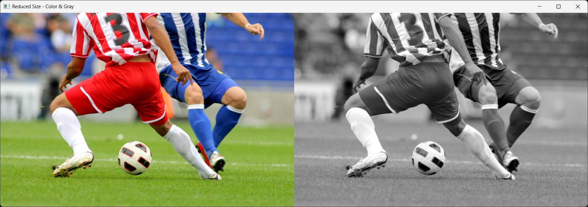
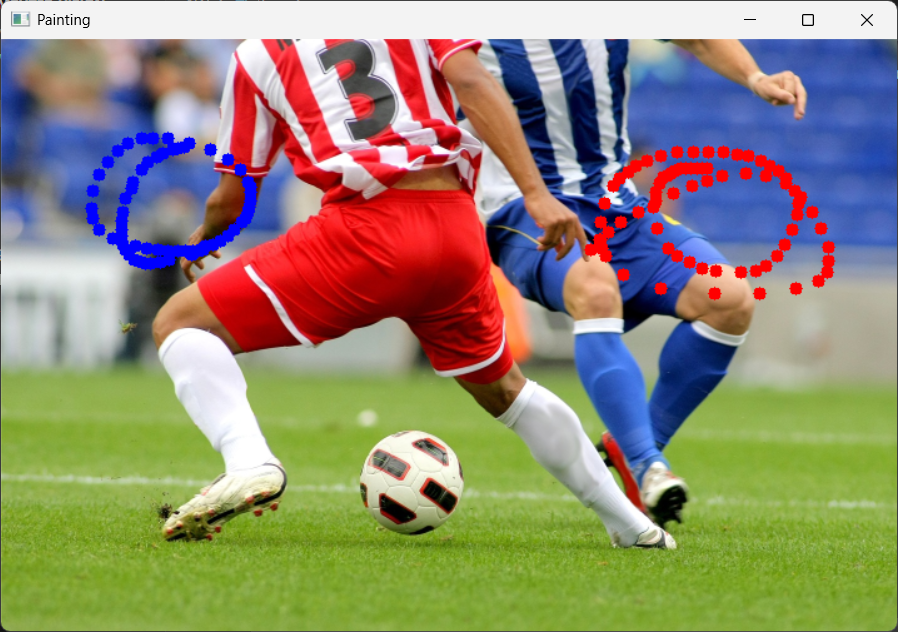
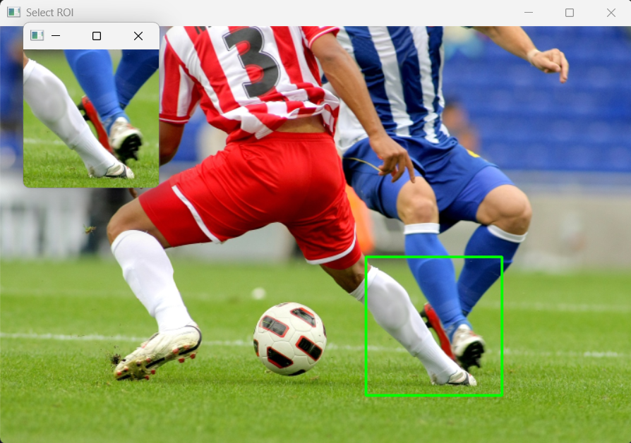

# 1. 이미지 로드 및 컬러/그레이스케일 비교 출력

- soccer.jpg를 로드하고 화면 크기에 맞게 0.5배 축소
- 축소된 이미지를 그레이스케일로 변환
- np.hstack으로 컬러 영상과 그레이 영상을 좌우로 연결
- 하나의 창에서 두 영상을 동시에 비교

<details>
    <summary>전체 코드</summary>

```python
import cv2 as cv
import sys
import numpy as np

# 1. 이미지 불러오기
img = cv.imread('soccer.jpg')

if img is None:
    sys.exit('파일이 존재하지 않습니다.')

# 2. 이미지 크기 줄이기 (0.5배 축소)
# fx, fy 인자를 사용하여 가로세로 비율을 조절합니다.
img_small = cv.resize(img, dsize=(0, 0), fx=0.5, fy=0.5)

# 3. 그레이스케일 변환 (축소된 이미지 기준)
gray = cv.cvtColor(img_small, cv.COLOR_BGR2GRAY)

# 4. hstack을 위해 그레이스케일 이미지를 3채널로 변환
gray_3channel = cv.cvtColor(gray, cv.COLOR_GRAY2BGR)

# 5. 원본(축소본)과 그레이스케일을 가로로 연결
combined = np.hstack((img_small, gray_3channel))

# 6. 결과 화면 출력
cv.imshow('Reduced Size - Color & Gray', combined)

# 속성 출력으로 크기 확인
print(f"Original Size: {img.shape}")
print(f"Reduced Size: {img_small.shape}")

cv.waitKey()
cv.destroyAllWindows()
```

</details>

## 1) 이미지 로드 후 화면 표시 크기로 축소

큰 원본 이미지를 그대로 띄우면 창이 너무 커질 수 있어 먼저 축소합니다.
이 단계에서 이후 처리 대상의 해상도가 결정됩니다.

```python
img = cv.imread('soccer.jpg')  # 원본 이미지 로드
img_small = cv.resize(img, dsize=(0, 0), fx=0.5, fy=0.5)  # 가로/세로 0.5배 축소
```

## 2) 그레이스케일 변환 후 hstack 가능한 형태로 정리

그레이스케일은 1채널이므로 컬러 영상(3채널)과 바로 이어붙일 수 없습니다.
따라서 COLOR_GRAY2BGR로 3채널로 맞춘 뒤 np.hstack을 수행합니다.

```python
gray = cv.cvtColor(img_small, cv.COLOR_BGR2GRAY)  # 흑백 변환
gray_3channel = cv.cvtColor(gray, cv.COLOR_GRAY2BGR)  # 1채널 -> 3채널 변환
combined = np.hstack((img_small, gray_3channel))  # 좌우 비교용 결합
```

## 3) 결합 영상 출력 및 크기 정보 확인

결과 영상을 띄우고, 콘솔에 원본/축소 크기를 함께 출력해 전처리 결과를 확인합니다.

```python
cv.imshow('Reduced Size - Color & Gray', combined)  # 결합 영상 출력
print(f"Original Size: {img.shape}")  # 원본 크기
print(f"Reduced Size: {img_small.shape}")  # 축소 크기
```

### 실행 결과




# 2. 마우스 페인팅 및 붓 크기 조절

- 마우스 좌클릭/우클릭으로 이미지에 색을 칠하는 인터랙션 구현
- 좌클릭은 파란색, 우클릭은 빨간색으로 드래그 페인팅 지원
- 키보드 `+`, `-`로 붓 크기를 조절하고 `q`로 종료
- 붓 크기는 1~15 범위로 제한

<details>
    <summary>전체 코드</summary>

```python
import cv2 as cv
import sys

# 1. 초기 설정
img = cv.imread('soccer.jpg')
if img is None:
    sys.exit('파일을 찾을 수 없습니다.')

# 이미지 크기 0.5배로 축소
img = cv.resize(img, dsize=(0, 0), fx=0.5, fy=0.5)

brush_size = 5  # 초기 붓 크기
L_color, R_color = (255, 0, 0), (0, 0, 255)  # 파란색(좌클릭), 빨간색(우클릭)

# 2. 마우스 콜백 함수 정의
def draw(event, x, y, flags, param):
    global brush_size
    
    # 좌클릭 또는 드래그 중 좌클릭 상태일 때 파란색 원 그리기
    if event == cv.EVENT_LBUTTONDOWN or (event == cv.EVENT_MOUSEMOVE and (flags & cv.EVENT_FLAG_LBUTTON)):
        cv.circle(img, (x, y), brush_size, L_color, -1)
    
    # 우클릭 또는 드래그 중 우클릭 상태일 때 빨간색 원 그리기
    elif event == cv.EVENT_RBUTTONDOWN or (event == cv.EVENT_MOUSEMOVE and (flags & cv.EVENT_FLAG_RBUTTON)):
        cv.circle(img, (x, y), brush_size, R_color, -1)
    
    cv.imshow('Painting', img)

# 3. 윈도우 생성 및 콜백 등록
cv.namedWindow('Painting')
cv.imshow('Painting', img)
cv.setMouseCallback('Painting', draw)

# 4. 키보드 입력 루프
while True:
    key = cv.waitKey(1) & 0xFF  # 1ms 대기하며 키 입력 받기
    
    if key == ord('q'):  # 'q' 누르면 종료
        break
    elif key == ord('+'):  # '+' 누르면 크기 증가 (최대 15)
        brush_size = min(brush_size + 1, 15)
        print(f"현재 붓 크기: {brush_size}")
    elif key == ord('-'):  # '-' 누르면 크기 감소 (최소 1)
        brush_size = max(brush_size - 1, 1)
        print(f"현재 붓 크기: {brush_size}")

cv.destroyAllWindows()
```

</details>

## 1) 마우스 이벤트로 좌/우 버튼 페인팅 처리

EVENT_LBUTTONDOWN, EVENT_RBUTTONDOWN, 그리고 드래그 상태(EVENT_MOUSEMOVE + 플래그)를 함께 처리해
한 번 클릭뿐 아니라 연속 붓질이 가능하도록 구성합니다.

```python
if event == cv.EVENT_LBUTTONDOWN or (event == cv.EVENT_MOUSEMOVE and (flags & cv.EVENT_FLAG_LBUTTON)):
    cv.circle(img, (x, y), brush_size, L_color, -1)  # 파란색 붓질
elif event == cv.EVENT_RBUTTONDOWN or (event == cv.EVENT_MOUSEMOVE and (flags & cv.EVENT_FLAG_RBUTTON)):
    cv.circle(img, (x, y), brush_size, R_color, -1)  # 빨간색 붓질
```

## 2) 키 입력으로 붓 크기 동적 조절

`cv.waitKey(1)` 루프에서 `+`, `-`, `q`를 실시간으로 받습니다.
min/max를 이용해 붓 크기가 지정 범위를 벗어나지 않도록 제한합니다.

```python
if key == ord('q'):
    break  # 종료
elif key == ord('+'):
    brush_size = min(brush_size + 1, 15)  # 최대 15
elif key == ord('-'):
    brush_size = max(brush_size - 1, 1)  # 최소 1
```

## 3) 콜백 등록 후 인터랙티브 창 유지

윈도우에 콜백을 연결해야 마우스 동작이 실제로 그림 작업으로 반영됩니다.

```python
cv.namedWindow('Painting')
cv.imshow('Painting', img)
cv.setMouseCallback('Painting', draw)  # 마우스 입력을 draw 함수에 연결
```

### 실행 결과




# 3. 마우스 드래그 기반 ROI 선택/추출/저장

- 사용자가 드래그한 사각형을 ROI로 추출
- 드래그 중에는 실시간 사각형 미리보기를 표시
- 마우스를 놓으면 ROI를 별도 창에 출력
- `r`로 리셋, `s`로 저장, `q`로 종료

<details>
    <summary>전체 코드</summary>

```python
import cv2 as cv
import sys

# 1. 이미지 로드 및 초기화
img = cv.imread('soccer.jpg')
if img is None:
    sys.exit('파일을 찾을 수 없습니다.')

# 이미지 크기 조절 (화면에 맞게 0.5배 축소)
img = cv.resize(img, dsize=(0, 0), fx=0.5, fy=0.5)
ori_img = img.copy()  # 리셋('r')을 위한 원본 복사본

# 전역 변수
ix, iy = -1, -1  # 마우스 클릭 시작 좌표
drawing = False
roi = None  # 선택된 영역을 저장할 변수

# 2. 마우스 콜백 함수 정의
def draw_roi(event, x, y, flags, param):
    global ix, iy, drawing, img, roi

    if event == cv.EVENT_LBUTTONDOWN:
        drawing = True
        ix, iy = x, y

    elif event == cv.EVENT_MOUSEMOVE:
        if drawing:
            # 드래그 중 실시간 사각형 표시
            img_draw = img.copy()
            cv.rectangle(img_draw, (ix, iy), (x, y), (0, 255, 0), 2) 
            cv.imshow('Select ROI', img_draw)

    elif event == cv.EVENT_LBUTTONUP:
        drawing = False
        # 사각형 그리기 확정
        cv.rectangle(img, (ix, iy), (x, y), (0, 255, 0), 2)
        cv.imshow('Select ROI', img)
        
        # ROI 추출
        # 좌표의 선후 관계가 바뀔 수 있으므로 min, max 사용 
        x1, x2 = min(ix, x), max(ix, x)
        y1, y2 = min(iy, y), max(iy, y)
        
        if x1 != x2 and y1 != y2:
            roi = ori_img[y1:y2, x1:x2]  # 원본 복사본에서 영역 추출
            cv.imshow('Cropped ROI', roi) # 별도의 창에 출력

# 3. 윈도우 생성 및 콜백 등록
cv.namedWindow('Select ROI')
cv.imshow('Select ROI', img)
cv.setMouseCallback('Select ROI', draw_roi)

# 4. 키보드 이벤트 처리 루프
while True:
    key = cv.waitKey(1) & 0xFF
    
    if key == ord('q'): # 종료
        break
        
    elif key == ord('r'): # 영역 선택 리셋
        img = ori_img.copy()
        roi = None
        cv.imshow('Select ROI', img)
        if cv.getWindowProperty('Cropped ROI', 0) >= 0:
            cv.destroyWindow('Cropped ROI')
        print("영역 선택이 리셋되었습니다.")
        
    elif key == ord('s'): # 선택 영역 저장
        if roi is not None:
            cv.imwrite('soccer_roi.jpg', roi)
            print("선택 영역이 'soccer_roi.jpg'로 저장되었습니다.")
        else:
            print("저장할 영역이 선택되지 않았습니다.")

cv.destroyAllWindows()
```

</details>

## 1) 드래그 기반 사각형 선택과 ROI 추출

마우스 다운에서 시작점을 기록하고, 업 이벤트에서 끝점을 받아 ROI를 확정합니다.
드래그 방향이 어떤 경우든 정상 처리되도록 min/max로 좌표를 정규화합니다.

```python
x1, x2 = min(ix, x), max(ix, x)
y1, y2 = min(iy, y), max(iy, y)

if x1 != x2 and y1 != y2:
    roi = ori_img[y1:y2, x1:x2]  # 원본에서 ROI 슬라이싱
    cv.imshow('Cropped ROI', roi)  # 선택 영역 미리보기
```

## 2) 드래그 중 실시간 시각화

사용자가 현재 어떤 영역을 선택 중인지 확인할 수 있도록,
마우스 이동마다 임시 복사본 위에 사각형을 그려 미리보기를 제공합니다.

```python
if drawing:
    img_draw = img.copy()  # 원본 작업 이미지 훼손 방지
    cv.rectangle(img_draw, (ix, iy), (x, y), (0, 255, 0), 2)
    cv.imshow('Select ROI', img_draw)
```

## 3) 키보드로 리셋/저장/종료 제어

`r`은 ROI 선택 상태 초기화, `s`는 ROI 파일 저장, `q`는 프로그램 종료입니다.
ROI가 없는 상태에서 저장을 누를 때도 안전하게 예외 메시지를 출력합니다.

```python
if key == ord('q'):
    break
elif key == ord('r'):
    img = ori_img.copy()
    roi = None
elif key == ord('s'):
    if roi is not None:
        cv.imwrite('soccer_roi.jpg', roi)
```

### 실행 결과

