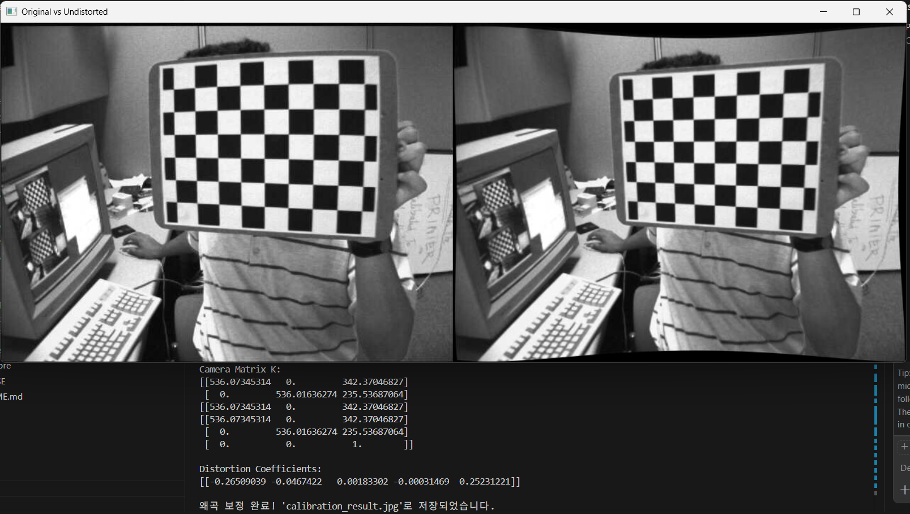
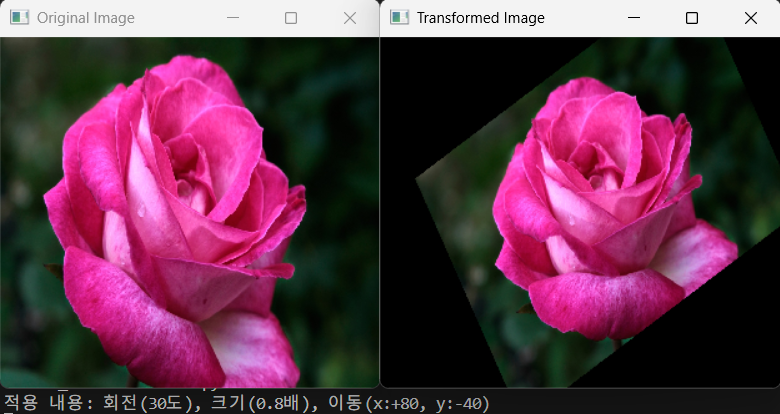
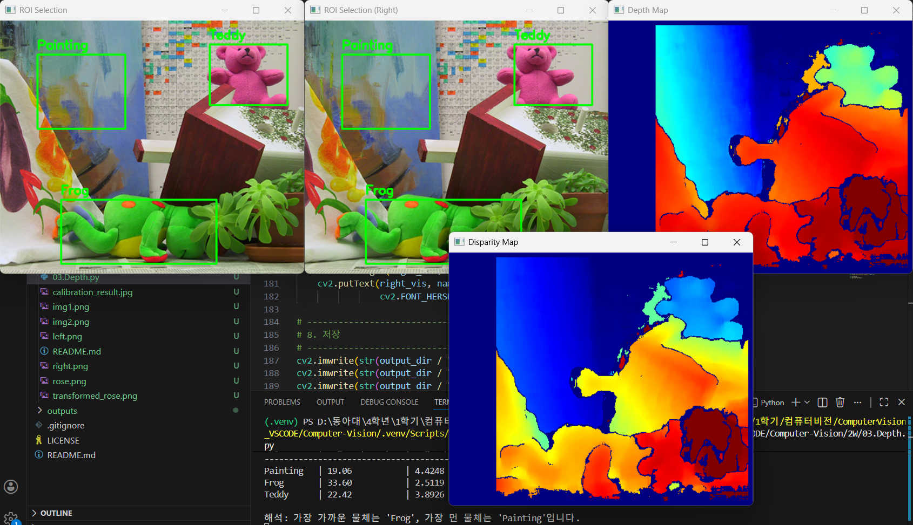

📸 1. 카메라 캘리브레이션 및 왜곡 보정(Camera Calibration)
OpenCV를 활용하여 체크보드 패턴으로부터 카메라의 내부 파라미터(Intrinsic Parameters)와 왜곡 계수(Distortion Coefficients)를 추출하고, 이를 통해 렌즈 왜곡이 발생한 이미지를 보정하는 실습 과제입니다.
1. 과제 개요
대부분의 카메라는 렌즈의 특성상 물리적인 왜곡(특히 주변부가 휘어지는 왜곡)을 가지고 있습니다. 이를 수학적으로 해결하기 위해 체크보드 패턴을 사용하여 카메라의 특성을 파악(Calibration)하고, 왜곡되지 않은 직선 이미지로 복원하는 것이 목적입니다.
2. 주요 기능
• 체크보드 코너 검출: cv2.findChessboardCorners를 사용하여 9x6 크기의 내부 코너를 자동으로 탐색합니다.
• 좌표 정밀화 (Sub-pixel Accuracy): cv2.cornerSubPix를 적용하여 픽셀 단위보다 더 정밀한 코너 위치를 계산합니다.
• 카메라 캘리브레이션: 3D 월드 좌표와 2D 이미지 좌표를 매핑하여 카메라 행렬($K$)과 왜곡 계수($dist$)를 산출합니다.
• 이미지 왜곡 보정: cv2.undistort와 getOptimalNewCameraMatrix를 사용하여 렌즈 왜곡을 제거합니다.
3. 전체코드
```python
import cv2
import numpy as np
import glob

# 체크보드 내부 코너 개수 (가로 9개, 세로 6개)
CHECKERBOARD = (9, 6)

# 체크보드 한 칸 실제 크기 (mm)
square_size = 25.0

# 코너 정밀화 조건
criteria = (cv2.TERM_CRITERIA_EPS + cv2.TERM_CRITERIA_MAX_ITER, 30, 0.001)

# 실제 좌표(3D) 생성: (0,0,0), (25,0,0), (50,0,0) ...
objp = np.zeros((CHECKERBOARD[0]*CHECKERBOARD[1], 3), np.float32)
objp[:, :2] = np.mgrid[0:CHECKERBOARD[0], 0:CHECKERBOARD[1]].T.reshape(-1, 2)
objp *= square_size

# 저장할 좌표
objpoints = [] # 3D 실제 세계 좌표
imgpoints = [] # 2D 이미지 평면 좌표

# 이미지 로드
images = glob.glob("2W/calibration_images/left*.jpg")

img_size = None

# -----------------------------
# 1. 체크보드 코너 검출
# -----------------------------
for fname in images:
    # 1-1. 이미지 읽기 및 그레이스케일 변환
    img = cv2.imread(fname)
    # findChessboardCorners는 연산 속도와 정확도를 위해 흑백(Grayscale) 이미지를 입력으로 받습니다.
    gray = cv2.cvtColor(img, cv2.COLOR_BGR2GRAY)
    
    # 이미지의 크기 저장 (나중에 캘리브레이션 함수에서 전체 이미지 규격을 알기 위해 사용)
    # gray.shape는 (height, width) 순서이므로 역순 [::-1]으로 취해 (width, height)로 만듭니다.
    img_size = gray.shape[::-1] 

    # 1-2. 체크보드 코너 찾기
    # CHECKERBOARD = (9, 6) : 내부 코너 점의 개수를 의미합니다.
    # ret: 성공 여부(True/False), corners: 검출된 코너들의 2D 좌표들
    ret, corners = cv2.findChessboardCorners(gray, CHECKERBOARD, None)

    # 코너가 정상적으로 모두 발견되었다면 (9x6=54개가 다 찾아져야 ret이 True가 됨)
    if ret == True:
        # 1-3. 실제 세계 좌표 추가
        # 모든 이미지에서 체크보드는 동일한 규격이므로, 미리 만들어둔 실제 좌표(objp)를 리스트에 담습니다.
        objpoints.append(objp)
        
        # 1-4. 코너 좌표 정밀화 (Sub-pixel Accuracy)
        # findChessboardCorners가 찾은 좌표는 픽셀 단위(정수)에 가깝습니다.
        # cv2.cornerSubPix를 사용하면 수학적으로 계산하여 소수점 단위의 아주 정밀한 위치를 찾아냅니다.
        # criteria: 정밀화 계산을 언제 멈출지 결정하는 조건 (반복 횟수 또는 목표 오차)
        corners2 = cv2.cornerSubPix(gray, corners, (11, 11), (-1, -1), criteria)
        
        # 정밀화된 2D 이미지 좌표를 리스트에 담습니다.
        imgpoints.append(corners2)

        # 1-5. 검출 결과 시각화
        # 찾은 코너들을 이미지 위에 선과 점으로 그려줍니다.
        cv2.drawChessboardCorners(img, CHECKERBOARD, corners2, ret)
        cv2.imshow('Corner Detection', img)
        # 검출되는 과정을 확인하기 위해 잠시 대기 (0.1초)
        cv2.waitKey(100)

cv2.destroyAllWindows()

# -----------------------------
# 2. 카메라 캘리브레이션
# -----------------------------
# cv2.calibrateCamera()를 통해 K(내부 행렬), dist(왜곡 계수) 산출
ret, K, dist, rvecs, tvecs = cv2.calibrateCamera(objpoints, imgpoints, img_size, None, None)

print("Camera Matrix K:")
print(K)

print("\nDistortion Coefficients:")
print(dist)

# -----------------------------
# 3. 왜곡 보정 시각화
# -----------------------------
# 테스트할 첫 번째 이미지 로드
test_img = cv2.imread(images[0])
h, w = test_img.shape[:2]

# 1. 새로운 카메라 매트릭스 계산 (검은 부분을 포함할지 결정)
# alpha=1: 모든 픽셀을 유지 (보정 후 휘어진 경계 때문에 검은 부분이 나타남)
# alpha=0: 검은 부분을 제거하고 유효한 픽셀만 남도록 잘라냄
new_camera_mtx, roi = cv2.getOptimalNewCameraMatrix(K, dist, (w, h), 1, (w, h))

# 2. 왜곡 보정 수행 (수정된 new_camera_mtx 사용)
dst = cv2.undistort(test_img, K, dist, None, new_camera_mtx)

# 3. 결과 시각화
# 원본과 왜곡 보정본을 가로로 붙여서 비교
result = np.hstack((test_img, dst))
cv2.imshow('Original vs Undistorted', result)

# 결과 저장
cv2.imwrite('2W/calibration_result.jpg', dst)
print("\n왜곡 보정 완료! 'calibration_result.jpg'로 저장되었습니다.")

cv2.waitKey(0)
cv2.destroyAllWindows()
```
4. 결과


🌀 2. 이미지 기하학적 변환 (Affine Transformation)
OpenCV의 아핀 변환(Affine Transformation) 기술을 사용하여 이미지에 회전, 크기 조절, 평행이동을 동시에 적용하는 실습 과제입니다. 여러 개의 변환을 하나의 행렬로 통합하여 효율적으로 이미지를 처리하는 방법을 학습합니다.
1. 과제 개요
단순한 이미지 편집을 넘어, 수학적인 변환 행렬(2 x 3 Matrix)을 조작하여 이미지를 원하는 위치와 각도로 재배치하는 것이 목적입니다. 각 변환(Rotation, Scaling, Translation)의 원리를 이해하고 이를 하나의 아핀 행렬에 합성하는 과정을 수행합니다.
2. 주요 요구사항
• 회전(Rotation): 이미지의 중심점을 기준으로 반시계 방향으로 30도 회전합니다.
• 크기 조절(Scaling): 회전과 동시에 원본 이미지 크기의 0.8배로 축소합니다.
• 평행이동(Translation): 변환된 결과를 x축으로 +80px, y축으로 -40px만큼 이동시킵니다.
• 행렬 조작: 별도의 함수를 여러 번 쓰지 않고, 하나의 변환 행렬 $M$의 요소를 직접 수정하여 모든 변환을 단 한번의 연산(warpAffine)으로 처리합니다.
3. 전체 코드
```python
import cv2
import numpy as np


# 1. 이미지 로드
img = cv2.imread('2W/rose.png')

# 이미지의 세로(h), 가로(w) 크기를 가져옵니다. 
# 변환 시 기준점이 될 이미지의 정중앙(center) 좌표를 계산합니다.
h, w = img.shape[:2]
center = (w // 2, h // 2) 

# 2. 회전 및 크기 조절 행렬 생성
# cv2.getRotationMatrix2D 함수는 (중심점, 회전각도, 배율)을 입력받아 2x3 행렬 M을 만듭니다.
angle = 30  # 반시계 방향으로 30도 회전
scale = 0.8  # 원본 이미지의 80% 크기로 축소
M = cv2.getRotationMatrix2D(center, angle, scale)


# 3. 평행이동 반영
# 변환 행렬 M의 구조는 다음과 같습니다:
# 여기서 M[0, 2]는 x축 평행이동(tx), M[1, 2]는 y축 평행이동(ty)을 담당

# 요구사항: x축 방향으로 +80px 이동 (오른쪽으로 이동)
M[0, 2] += 80
# 요구사항: y축 방향으로 -40px 이동 (위쪽으로 이동)
M[1, 2] += -40

# 4. Affine 변환 적용
# cv2.warpAffine은 계산된 행렬 M을 이미지의 모든 픽셀에 적용하여 실제 변환을 수행합니다.
# 마지막 인자 (w, h)는 결과 이미지의 출력 크기를 결정합니다.
dst = cv2.warpAffine(img, M, (w, h))

# ---------------------------------------------------------
# 5. 시각화
# ---------------------------------------------------------

# 원본 이미지를 보여주는 창
cv2.namedWindow('Original Image', cv2.WINDOW_NORMAL)
cv2.imshow('Original Image', img)

# 변환(회전+축소+이동)이 완료된 이미지를 보여주는 창
cv2.namedWindow('Transformed Image', cv2.WINDOW_NORMAL)
cv2.imshow('Transformed Image', dst)

# 터미널 창에 현재 적용된 수치를 출력하여 확인합니다.
print(f"적용 내용: 회전({angle}도), 크기({scale}배), 이동(x:+80, y:-40)")

# 변환된 이미지를 파일로 저장합니다.
cv2.imwrite('2W/transformed_rose.png', dst)

# 아무 키나 누를 때까지 창을 유지하다가, 키 입력이 있으면 모든 창을 닫고 프로그램을 종료합니다.
cv2.waitKey(0)
cv2.destroyAllWindows()
```
4. 결과


📐 3. 스테레오 시차 기반 깊이 추정 (Stereo Depth Estimation)
두 대의 카메라(스테레오 카메라) 시스템을 통해 촬영된 좌/우 이미지 쌍을 이용하여 물체와의 거리(Depth)를 계산하는 실습 과제입니다. 픽셀 간의 시차(Disparity) 정보를 물리적인 거리 단위로 변환하는 과정을 포함합니다.
1. 과제 개요
인간의 눈이 사물을 입체적으로 인식하는 원리와 동일하게, 두 이미지에서 동일한 물체가 나타나는 위치 차이를 분석합니다. 이 시차 정보를 활용하여 2차원 이미지로부터 3차원 깊이 정보(Depth Map)를 추출하고, 특정 관심 영역(ROI)의 실제 거리를 미터(m) 단위로 추정합니다.
2. 주요 요구사항 및 물리 파라미터
• 시차 계산: cv2.StereoBM 알고리즘을 사용하여 좌/우 영상의 픽셀 변위를 계산합니다.
• 깊이 변환: 공식 z = fB / d 를 적용하여 시차를 거리로 변환합니다.
• 카메라 파라미터:
    - 초점 거리 ($f$): 700.0 (픽셀 단위)
    - 베이스라인 ($B$): 0.12m (두 카메라 사이의 거리)
• 대상 분석: Painting, Frog, Teddy 세 영역의 평균 깊이를 계산하고 거리를 비교합니다.
3. 전체 코드
```python
import cv2
import numpy as np
from pathlib import Path


# 출력 폴더 생성
output_dir = Path("./outputs")
output_dir.mkdir(parents=True, exist_ok=True)

# 좌/우 이미지 불러오기
left_color = cv2.imread("2W/left.png")
right_color = cv2.imread("2W/right.png")

# 카메라 파라미터
f = 700.0  # 초점 거리 (focal length)
B = 0.12   # 베이스라인 (두 카메라 사이 거리, 12cm)

# ROI 설정 (x, y, w, h)
rois = {
    "Painting": (55, 50, 130, 110),
    "Frog": (90, 265, 230, 95),
    "Teddy": (310, 35, 115, 90)
}

# [그레이스케일 변환] - 스테레오 매칭을 위해 흑백 변환 필수
left_gray = cv2.cvtColor(left_color, cv2.COLOR_BGR2GRAY)
right_gray = cv2.cvtColor(right_color, cv2.COLOR_BGR2GRAY)

# ---------------------------------------------------------
# 1. Disparity(시차) 계산
# ---------------------------------------------------------
# cv2.StereoBM_create: 블록 매칭(Block Matching) 알고리즘 객체를 생성합니다.
# numDisparities: 왼쪽-오른쪽 이미지 사이에서 탐색할 최대 픽셀 거리 차이입니다. 반드시 16의 배수여야 합니다.
# blockSize: 매칭 시 비교할 작은 사각형 영역의 크기
stereo = cv2.StereoBM_create(numDisparities=64, blockSize=15)

# .compute: 왼쪽과 오른쪽 흑백 영상을 비교하여 시차 지도(Disparity Map)를 생성합니다.
disparity_raw = stereo.compute(left_gray, right_gray)

# [중요] StereoBM 알고리즘은 연산의 정밀도를 위해 내부적으로 결과값에 16을 곱하여 정수형으로 반환합니다.
# 실제 픽셀 단위의 시차값(d)을 얻으려면 반드시 float32 타입으로 바꾼 뒤 16으로 나누어야 합니다.
disparity = disparity_raw.astype(np.float32) / 16.0


# ---------------------------------------------------------
# 2. Depth(깊이/거리) 계산 (Z = fB / d)
# ---------------------------------------------------------
# 시차(disparity) 정보를 실제 세계의 거리 단위(m)인 Depth로 변환하는 과정입니다.
# 결과를 담을 빈 배열을 원본 이미지와 같은 크기로 생성합니다.
depth_map = np.zeros(disparity.shape, dtype=np.float32)

# 시차(d)가 0인 픽셀은 '무한히 먼 곳'이거나 '매칭 실패' 영역이므로 제외해야 합니다.
# (0으로 나누기 에러 방지 및 유효한 데이터만 추출)
valid_mask = disparity > 0

# 공식 적용: Z (거리) = f (초점거리) * B (카메라 간격) / d (시차)
# d가 분모에 있으므로, 시차(d)가 클수록 거리(Z)는 짧아집니다(가까워집니다).
depth_map[valid_mask] = (f * B) / disparity[valid_mask]


# ---------------------------------------------------------
# 3. ROI(관심 영역)별 평균 disparity / depth 계산
# ---------------------------------------------------------
results = {}

# 딕셔너리에 저장된 각 객체(Painting, Frog, Teddy)의 좌표를 순회합니다.
for name, (x, y, w, h) in rois.items():
    # 이미지 슬라이싱을 통해 해당 물체가 위치한 영역(Box)만 잘라냅니다.
    roi_disp = disparity[y:y+h, x:x+w]
    roi_depth = depth_map[y:y+h, x:x+w]
    
    # 해당 사각형 영역 안에서도 시차가 유효한(>0) 픽셀들만 골라내어 마스크를 만듭니다.
    valid_roi_mask = roi_disp > 0
    
    # 영역 내의 유효한 값들의 평균을 계산합니다. (값이 없으면 0으로 처리)
    # 평균 시차(avg_disp)와 평균 거리(avg_depth)를 구합니다.
    avg_disp = np.mean(roi_disp[valid_roi_mask]) if np.any(valid_roi_mask) else 0
    avg_depth = np.mean(roi_depth[valid_roi_mask]) if np.any(valid_roi_mask) else 0
    
    # 결과를 사물 이름별로 저장합니다.
    results[name] = (avg_disp, avg_depth)

# ---------------------------------------------------------
# 4. 결과 출력 및 데이터 해석
# ---------------------------------------------------------
# f-string을 이용해 표 형태로 깔끔하게 출력합니다.
print(f"{'Object':<10} | {'Avg Disparity':<15} | {'Avg Depth (m)':<15}")
print("-" * 45)
for name, (d, z) in results.items():
    print(f"{name:<10} | {d:<15.2f} | {z:<15.4f}")

# min/max 함수와 key 인자를 활용해 결과 분석
# 가장 가까운 물체: Depth(z) 값이 가장 작은 객체를 찾습니다.
closest = min(results, key=lambda k: results[k][1])

# 가장 먼 물체: Depth(z) 값이 가장 큰 객체를 찾습니다.
farthest = max(results, key=lambda k: results[k][1])

print(f"\n해석: 가장 가까운 물체는 '{closest}', 가장 먼 물체는 '{farthest}'입니다.")

# ---------------------------------------------------------
# 5. Disparity(시차) 시각화
# 목적: 0~64 범위의 시차 값을 0~255 색상으로 변환하여 열지도(Heatmap) 생성
# ---------------------------------------------------------
# 데이터 오염을 방지하기 위해 복사본 생성 후, 값이 없는(<=0) 부분은 NaN(계산 제외) 처리
disp_tmp = disparity.copy()
disp_tmp[disp_tmp <= 0] = np.nan

# 모든 픽셀이 매칭에 실패했을 경우를 대비한 예외 처리
if np.all(np.isnan(disp_tmp)):
    raise ValueError("유효한 disparity 값이 없습니다.")

# 이상치(Outlier)를 제거하고 색상 대비를 높이기 위해 하위 5%, 상위 95% 값을 기준으로 설정
d_min = np.nanpercentile(disp_tmp, 5)
d_max = np.nanpercentile(disp_tmp, 95)

# 0으로 나누기 방지를 위한 안전 장치
if d_max <= d_min:
    d_max = d_min + 1e-6

# 데이터를 0.0 ~ 1.0 사이로 정규화 (Normalization)
disp_scaled = (disp_tmp - d_min) / (d_max - d_min)
disp_scaled = np.clip(disp_scaled, 0, 1)

# 0~255 범위의 8비트 정수형 이미지로 변환
disp_vis = np.zeros_like(disparity, dtype=np.uint8)
valid_disp = ~np.isnan(disp_tmp)
disp_vis[valid_disp] = (disp_scaled[valid_disp] * 255).astype(np.uint8)

# COLORMAP_JET 적용: 큰 값(가까운 곳)은 빨간색, 작은 값(먼 곳)은 파란색으로 표시
disparity_color = cv2.applyColorMap(disp_vis, cv2.COLORMAP_JET)


# ---------------------------------------------------------
# 6. Depth(깊이) 시각화
# 목적: 실제 거리(m) 데이터를 색상으로 표현 (가까울수록 빨강, 멀수록 파랑)
# ---------------------------------------------------------
depth_vis = np.zeros_like(depth_map, dtype=np.uint8)

if np.any(valid_mask):
    depth_valid = depth_map[valid_mask]

    # 거리 데이터도 마찬가지로 하위 5%, 상위 95%를 기준으로 정규화 범위 설정
    z_min = np.percentile(depth_valid, 5)
    z_max = np.percentile(depth_valid, 95)

    if z_max <= z_min:
        z_max = z_min + 1e-6

    # 0.0(가장 가까움) ~ 1.0(가장 멂)으로 변환
    depth_scaled = (depth_map - z_min) / (z_max - z_min)
    depth_scaled = np.clip(depth_scaled, 0, 1)

    # [중요] Depth는 값이 클수록 멀기 때문에, 1.0에서 빼주어 반전시킵니다.
    # 이렇게 해야 시각적으로 '가까운 물체가 빨간색'으로 통일됩니다.
    depth_scaled = 1.0 - depth_scaled
    depth_vis[valid_mask] = (depth_scaled[valid_mask] * 255).astype(np.uint8)

# 최종적으로 색상을 입힘
depth_color = cv2.applyColorMap(depth_vis, cv2.COLORMAP_JET)

# ---------------------------------------------------------
# 7. Left / Right 이미지에 ROI(관심 영역) 표시
# 목적: 분석 대상인 Painting, Frog, Teddy가 어디인지 이미지에 사각형으로 그림
# ---------------------------------------------------------
left_vis = left_color.copy()
right_vis = right_color.copy()

for name, (x, y, w, h) in rois.items():
    # cv2.rectangle: 원본 이미지에 (x, y)부터 (x+w, y+h)까지 초록색(0, 255, 0) 사각형 그림
    cv2.rectangle(left_vis, (x, y), (x + w, y + h), (0, 255, 0), 2)
    # cv2.putText: 사각형 위에 물체의 이름(Painting 등)을 텍스트로 표기
    cv2.putText(left_vis, name, (x, y - 8),
                cv2.FONT_HERSHEY_SIMPLEX, 0.6, (0, 255, 0), 2)

    # 오른쪽 이미지에도 동일하게 표시하여 두 시점의 차이를 확인 가능하게 함
    cv2.rectangle(right_vis, (x, y), (x + w, y + h), (0, 255, 0), 2)
    cv2.putText(right_vis, name, (x, y - 8),
                cv2.FONT_HERSHEY_SIMPLEX, 0.6, (0, 255, 0), 2)

# -----------------------------
# 8. 저장
# -----------------------------
cv2.imwrite(str(output_dir / "disparity_color.png"), disparity_color)
cv2.imwrite(str(output_dir / "depth_color.png"), depth_color)
cv2.imwrite(str(output_dir / "roi_left.png"), left_vis)
cv2.imwrite(str(output_dir / "roi_right.png"), right_vis)

# -----------------------------
# 9. 출력 (이미지 보기)
# -----------------------------
cv2.imshow("Disparity Map", disparity_color)
cv2.imshow("Depth Map", depth_color)
cv2.imshow("ROI Selection", left_vis)
cv2.imshow("ROI Selection (Right)", right_vis)

cv2.waitKey(0)
cv2.destroyAllWindows()
```
4. 출력
