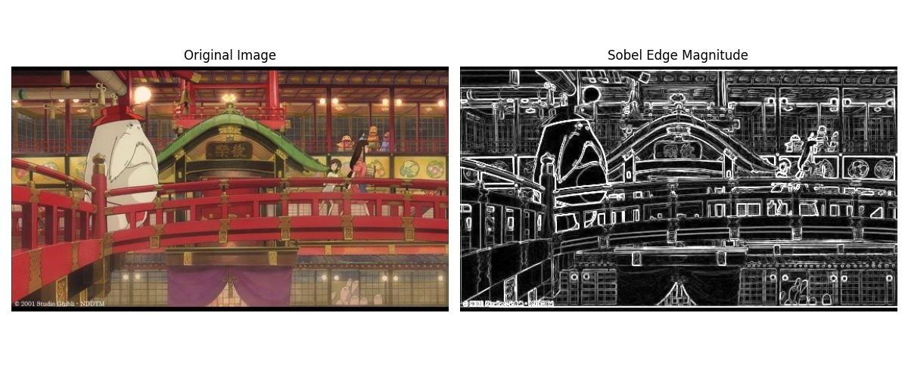
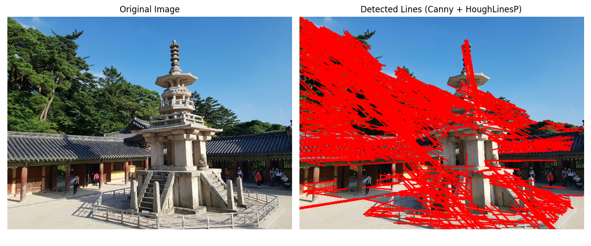
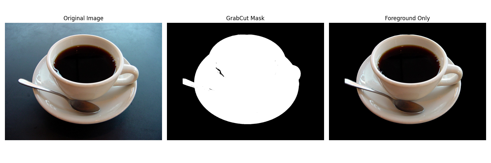

# 1. Sobel 에지 검출 및 결과 시각화

- edgeDetectionImage.jpg를 그레이스케일로 변환
- Sobel 필터로 x, y 방향 에지를 각각 계산
- cv.magnitude로 에지 강도를 계산하고 cv.convertScaleAbs로 시각화 가능한 형태로 변환
- matplotlib를 사용해 원본 이미지와 에지 강도 이미지를 나란히 출력

<details>
	<summary>전체 코드</summary>

```python
import os
import cv2 as cv
import matplotlib.pyplot as plt
import numpy as np


def main():
	# 1) 입력 이미지 준비
	script_dir = os.path.dirname(os.path.abspath(__file__))
	image_path = os.path.join(script_dir, "edgeDetectionImage.jpg")

	# cv.imread()로 이미지 읽기
	original_bgr = cv.imread(image_path)

	# 한글 경로 등으로 imread가 실패할 때를 대비한 보조 로딩
	if original_bgr is None:
		raw = np.fromfile(image_path, dtype=np.uint8)
		if raw.size > 0:
			original_bgr = cv.imdecode(raw, cv.IMREAD_COLOR)

	if original_bgr is None:
		raise FileNotFoundError(f"이미지를 불러올 수 없습니다: {image_path}")

	# 2) Sobel 에지 계산
	gray = cv.cvtColor(original_bgr, cv.COLOR_BGR2GRAY)
	sobel_x = cv.Sobel(gray, cv.CV_64F, 1, 0, ksize=3)
	sobel_y = cv.Sobel(gray, cv.CV_64F, 0, 1, ksize=3)

	edge_magnitude = cv.magnitude(sobel_x, sobel_y)
	edge_uint8 = cv.convertScaleAbs(edge_magnitude)

	# 3) 시각화
	original_rgb = cv.cvtColor(original_bgr, cv.COLOR_BGR2RGB)

	plt.figure(figsize=(12, 5))

	plt.subplot(1, 2, 1)
	plt.imshow(original_rgb)
	plt.title("Original Image")
	plt.axis("off")

	plt.subplot(1, 2, 2)
	plt.imshow(edge_uint8, cmap="gray")
	plt.title("Sobel Edge Magnitude")
	plt.axis("")

	plt.tight_layout()
	plt.show()


if __name__ == "__main__":
	main()
```

</details>

## 1) cv.imread와 cvtColor로 입력을 준비

입력 이미지가 정상 로드되면 컬러(BGR) 이미지를 그레이스케일로 바꿉니다.
Sobel, Canny 같은 에지 연산은 밝기 변화 기반이므로 흑백 입력이 일반적으로 더 안정적입니다.

```python
original_bgr = cv.imread(image_path)  # 파일에서 원본 BGR 이미지 읽기
gray = cv.cvtColor(original_bgr, cv.COLOR_BGR2GRAY)  # 에지 계산용 흑백 영상 생성
```

## 2) Sobel x, y 성분 계산 후 magnitude 계산

Sobel x는 수직 경계(좌우 밝기 변화), Sobel y는 수평 경계(상하 밝기 변화)에 민감합니다.
두 성분을 합성해 최종 에지 강도 이미지를 만들고, 화면 표시를 위해 uint8로 변환합니다.

```python
sobel_x = cv.Sobel(gray, cv.CV_64F, 1, 0, ksize=3)  # x 방향 미분
sobel_y = cv.Sobel(gray, cv.CV_64F, 0, 1, ksize=3)  # y 방향 미분
edge_magnitude = cv.magnitude(sobel_x, sobel_y)  # 두 축 에지를 합쳐 전체 강도 계산
edge_uint8 = cv.convertScaleAbs(edge_magnitude)  # 시각화를 위해 0~255 범위로 변환
```

## 3) 원본과 에지 이미지를 나란히 시각화

왼쪽에는 원본, 오른쪽에는 Sobel 에지 강도를 배치하여 처리 전후를 한 번에 비교합니다.

```python
plt.subplot(1, 2, 1)  # 1행 2열 중 첫 번째(원본)
plt.imshow(original_rgb)
plt.title("Original Image")

plt.subplot(1, 2, 2)  # 1행 2열 중 두 번째(에지)
plt.imshow(edge_uint8, cmap="gray")  # 강도 영상을 흑백 컬러맵으로 표시
plt.title("Sobel Edge Magnitude")
```

### 실행 결과




# 2. Canny 에지 + HoughLinesP 직선 검출

- dabo.jpg에 대해 Canny 에지 맵 생성
- HoughLinesP로 선분 검출
- 검출된 선분을 빨간색으로 원본 복사본에 표시
- matplotlib로 원본과 검출 결과를 나란히 출력

<details>
	<summary>전체 코드</summary>

```python
import os
import cv2 as cv
import matplotlib.pyplot as plt
import numpy as np


def main():
	# 1) 입력 이미지 준비
	script_dir = os.path.dirname(os.path.abspath(__file__))
	image_path = os.path.join(script_dir, "dabo.jpg")

	original_bgr = cv.imread(image_path)

	# 한글 경로 등으로 imread가 실패할 때를 대비한 보조 로딩
	if original_bgr is None:
		raw = np.fromfile(image_path, dtype=np.uint8)
		if raw.size > 0:
			original_bgr = cv.imdecode(raw, cv.IMREAD_COLOR)

	if original_bgr is None:
		raise FileNotFoundError(f"이미지를 불러올 수 없습니다: {image_path}")

	# 2) 에지 검출
	gray = cv.cvtColor(original_bgr, cv.COLOR_BGR2GRAY)
	edges = cv.Canny(gray, 100, 200)

	# 3) 허프 직선 검출
	lines = cv.HoughLinesP(
		edges,
		rho=1,
		theta=np.pi / 180,
		threshold=80,
		minLineLength=50,
		maxLineGap=10,
	)

	# 4) 검출 선분 표시
	line_image = original_bgr.copy()
	if lines is not None:
		for line in lines:
			x1, y1, x2, y2 = line[0]
			cv.line(line_image, (x1, y1), (x2, y2), (0, 0, 255), 2)

	# 5) 시각화
	original_rgb = cv.cvtColor(original_bgr, cv.COLOR_BGR2RGB)
	line_rgb = cv.cvtColor(line_image, cv.COLOR_BGR2RGB)

	plt.figure(figsize=(12, 5))

	plt.subplot(1, 2, 1)
	plt.imshow(original_rgb)
	plt.title("Original Image")
	plt.axis("off")

	plt.subplot(1, 2, 2)
	plt.imshow(line_rgb)
	plt.title("Detected Lines (Canny + HoughLinesP)")
	plt.axis("off")

	plt.tight_layout()
	plt.show()


if __name__ == "__main__":
	main()
```

</details>

## 1) Canny로 에지 맵 생성

먼저 그레이스케일로 변환한 뒤, Canny의 두 임계값(100, 200)으로 강한 경계를 선별합니다.
이 단계의 결과가 이후 Hough 직선 검출의 입력이 됩니다.

```python
gray = cv.cvtColor(original_bgr, cv.COLOR_BGR2GRAY)  # Canny 전처리용 흑백 변환
edges = cv.Canny(gray, 100, 200)  # threshold1=100, threshold2=200
```

## 2) HoughLinesP로 직선 검출

확률적 허프 변환을 이용해 에지 픽셀 집합에서 선분을 찾습니다.
threshold, minLineLength, maxLineGap은 검출 민감도와 연결 품질을 결정하는 핵심 파라미터입니다.

```python
lines = cv.HoughLinesP(
	edges,  # Canny 에지 맵 입력
	rho=1,  # 거리 해상도(픽셀)
	theta=np.pi / 180,  # 각도 해상도(1도)
	threshold=80,  # 최소 누적 투표 수
	minLineLength=50,  # 최소 선분 길이
	maxLineGap=10,  # 끊긴 선분을 연결할 최대 간격
)
```

## 3) 직선을 빨간색으로 그려 시각화

검출된 각 선분의 시작점/끝점을 꺼내 원본 복사본 위에 빨간색으로 덧그립니다.
선 두께는 2로 지정해 가시성을 확보합니다.

```python
if lines is not None:
	for line in lines:
		x1, y1, x2, y2 = line[0]  # 검출된 선분 좌표 추출
		cv.line(line_image, (x1, y1), (x2, y2), (0, 0, 255), 2)  # 빨간색 선 그리기
```

### 실행 결과




# 3. GrabCut 기반 객체 분할 및 배경 제거

- coffee cup.jpg에서 사각형 초기영역 기반 GrabCut 분할 수행
- GrabCut 라벨을 이진 마스크로 변환하여 전경/배경 분리
- 마스크를 원본에 곱해 배경 제거된 객체 이미지 생성
- 원본, 마스크, 배경 제거 결과를 3열로 시각화

<details>
	<summary>전체 코드</summary>

```python
import os
import cv2 as cv
import matplotlib.pyplot as plt
import numpy as np


def main():
	# 1) 입력 이미지 준비
	script_dir = os.path.dirname(os.path.abspath(__file__))
	image_path = os.path.join(script_dir, "coffee cup.jpg")

	original_bgr = cv.imread(image_path)

	# 한글 경로 등으로 imread가 실패할 때를 대비한 보조 로딩
	if original_bgr is None:
		raw = np.fromfile(image_path, dtype=np.uint8)
		if raw.size > 0:
			original_bgr = cv.imdecode(raw, cv.IMREAD_COLOR)

	if original_bgr is None:
		raise FileNotFoundError(f"이미지를 불러올 수 없습니다: {image_path}")

	# 2) GrabCut 준비
	mask = np.zeros(original_bgr.shape[:2], np.uint8)
	bgd_model = np.zeros((1, 65), np.float64)
	fgd_model = np.zeros((1, 65), np.float64)

	# (x, y, width, height)
	h, w = original_bgr.shape[:2]
	rect = (int(w * 0.1), int(h * 0.1), int(w * 0.8), int(h * 0.8))

	# 3) GrabCut 실행
	cv.grabCut(
		original_bgr,
		mask,
		rect,
		bgd_model,
		fgd_model,
		iterCount=5,
		mode=cv.GC_INIT_WITH_RECT,
	)

	# 4) 라벨 마스크를 이진 마스크로 변환
	mask_binary = np.where(
		(mask == cv.GC_BGD) | (mask == cv.GC_PR_BGD),
		0,
		1,
	).astype("uint8")

	# 5) 배경 제거
	foreground_bgr = original_bgr * mask_binary[:, :, np.newaxis]

	# 6) 시각화
	original_rgb = cv.cvtColor(original_bgr, cv.COLOR_BGR2RGB)
	foreground_rgb = cv.cvtColor(foreground_bgr, cv.COLOR_BGR2RGB)

	plt.figure(figsize=(15, 5))

	plt.subplot(1, 3, 1)
	plt.imshow(original_rgb)
	plt.title("Original Image")
	plt.axis("off")

	plt.subplot(1, 3, 2)
	plt.imshow(mask_binary, cmap="gray")
	plt.title("GrabCut Mask")
	plt.axis("off")

	plt.subplot(1, 3, 3)
	plt.imshow(foreground_rgb)
	plt.title("Foreground Only")
	plt.axis("off")

	plt.tight_layout()
	plt.show()


if __name__ == "__main__":
	main()
```

</details>

## 1) GrabCut 초기화와 사각형 설정

GrabCut은 마스크와 배경/전경 모델 배열을 기반으로 동작합니다.
초기 사각형(rect)은 객체가 포함될 가능성이 높은 영역을 지정해 분할의 시작점을 제공합니다.

```python
mask = np.zeros(original_bgr.shape[:2], np.uint8)  # 픽셀 라벨 저장용 마스크
bgd_model = np.zeros((1, 65), np.float64)  # 배경 GMM 모델 파라미터
fgd_model = np.zeros((1, 65), np.float64)  # 전경 GMM 모델 파라미터

h, w = original_bgr.shape[:2]
rect = (int(w * 0.1), int(h * 0.1), int(w * 0.8), int(h * 0.8))  # (x, y, width, height)
```

## 2) GrabCut 수행 후 이진 마스크 변환

GrabCut 실행 후 마스크에는 확정/추정 배경·전경 라벨이 저장됩니다.
여기서는 배경 계열(GC_BGD, GC_PR_BGD)은 0, 전경 계열은 1로 변환해 후처리에 사용합니다.

```python
cv.grabCut(
	original_bgr,
	mask,
	rect,
	bgd_model,
	fgd_model,
	iterCount=5,
	mode=cv.GC_INIT_WITH_RECT,  # 사각형 기반 초기화 모드
)

mask_binary = np.where(
	(mask == cv.GC_BGD) | (mask == cv.GC_PR_BGD),  # 배경 또는 배경 추정
	0,  # 배경
	1,  # 전경
).astype("uint8")
```

## 3) 마스크로 배경 제거 및 3장 시각화

이진 마스크를 채널 방향으로 확장해 원본에 곱하면 배경이 제거된 전경만 남습니다.
원본, 마스크, 배경 제거 결과를 나란히 배치해 분할 품질을 빠르게 확인할 수 있습니다.

```python
foreground_bgr = original_bgr * mask_binary[:, :, np.newaxis]  # 배경 픽셀을 0으로 제거

plt.subplot(1, 3, 1)  # 원본
plt.imshow(original_rgb)
plt.title("Original Image")

plt.subplot(1, 3, 2)  # 마스크
plt.imshow(mask_binary, cmap="gray")  # 0=배경(검정), 1=전경(흰색)
plt.title("GrabCut Mask")

plt.subplot(1, 3, 3)  # 배경 제거 결과
plt.imshow(foreground_rgb)
plt.title("Foreground Only")
```

### 실행 결과


