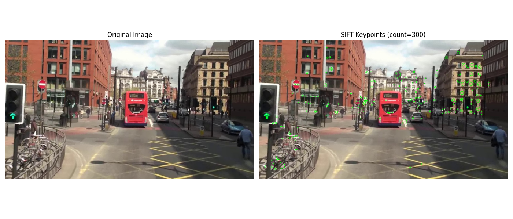
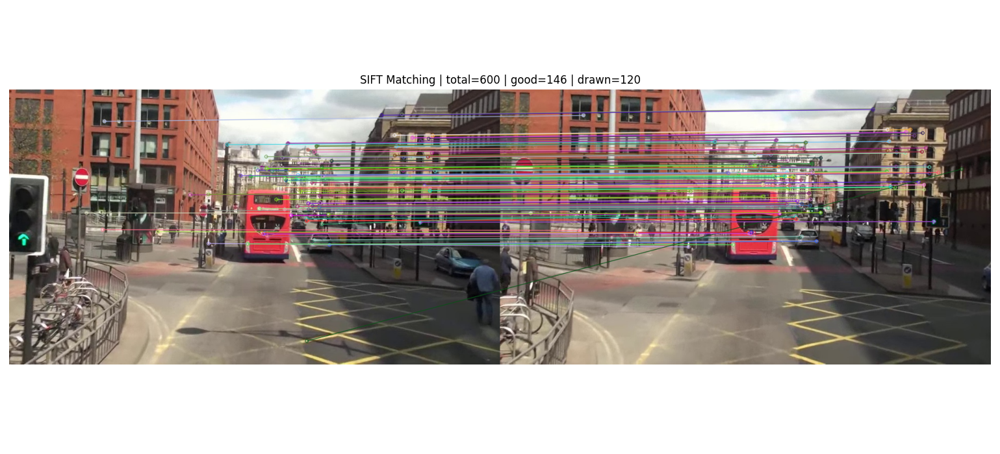
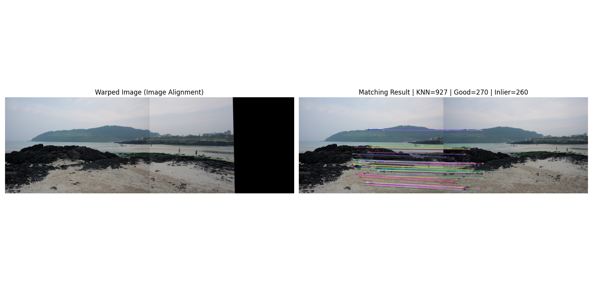

# 1. SIFT 특징점 검출 및 시각화

## 1 문제 및 요구사항

- mot_color70.jpg를 로드하고 SIFT 특징점을 검출
- 검출된 특징점을 단일 색상(초록색)으로 시각화
- 특징점의 크기/방향 정보를 함께 표시
- matplotlib로 원본 이미지와 특징점 결과를 나란히 출력

## 2 코드설명

<details>
    <summary>전체 코드</summary>

```python
import os
import cv2 as cv
import numpy as np
import matplotlib.pyplot as plt


# 이미지 로딩을 담당하는 보조 함수 정의
def load_bgr_image(image_path: str):
    """Load image robustly, including non-ASCII paths on Windows."""
    # 1차 시도: 일반적인 OpenCV 이미지 로드
    image_bgr = cv.imread(image_path)
    # 1차 로드 실패 시 보조 로딩 경로로 진입
    if image_bgr is None:
        # 파일 바이트를 uint8 배열로 직접 읽기
        raw = np.fromfile(image_path, dtype=np.uint8)
        # 읽은 바이트가 비어 있지 않으면 디코딩 시도
        if raw.size > 0:
            # 바이트 배열을 컬러 이미지로 디코딩
            image_bgr = cv.imdecode(raw, cv.IMREAD_COLOR)
    # 최종 로드 결과 반환 (성공 시 ndarray, 실패 시 None)
    return image_bgr


def main():
    # 1) 입력 이미지 경로
    script_dir = os.path.dirname(os.path.abspath(__file__))
    image_path = os.path.join(script_dir, "mot_color70.jpg")

    # 2) 이미지 로드
    # 보조 함수로 BGR 이미지 로딩 수행
    original_bgr = load_bgr_image(image_path)
    if original_bgr is None:
        raise FileNotFoundError(f"이미지를 불러올 수 없습니다: {image_path}")

    # 3) SIFT 객체 생성 (매개변수 조정 가능)
    # SIFT 검출기/기술자 객체 생성
    sift = cv.SIFT_create(
        # 최대 특징점 개수를 300개로 제한
        nfeatures=300,
        # 대비 임계값 설정 (값이 작을수록 더 많은 특징점)
        contrastThreshold=0.04,
        # 에지 응답 제거 임계값 설정
        edgeThreshold=10,
        # 가우시안 스케일 공간의 초기 시그마 설정
        sigma=1.6,
    )

    # 4) 특징점 검출 및 기술자 계산
    # 입력 이미지에서 keypoints와 descriptors를 동시에 계산
    keypoints, descriptors = sift.detectAndCompute(original_bgr, None)

    # 5) 특징점 시각화 (크기/방향 포함)
    # 원본 이미지 위에 특징점을 덧그린 시각화 이미지 생성
    keypoint_viz_bgr = cv.drawKeypoints(
        # 입력 원본 BGR 이미지
        original_bgr,
        # 검출된 특징점 목록
        keypoints,
        # 출력 이미지 버퍼를 OpenCV가 새로 생성하도록 None 전달
        None,
        # 특징점 색상을 초록색(BGR)으로 통일
        color=(0, 255, 0),
        # 원형 크기/방향까지 보이는 rich keypoint 플래그 사용
        flags=cv.DRAW_MATCHES_FLAGS_DRAW_RICH_KEYPOINTS,
    )

    # 6) matplotlib 표시를 위한 BGR -> RGB 변환
    # 원본 이미지를 matplotlib 표시에 맞게 RGB로 변환
    original_rgb = cv.cvtColor(original_bgr, cv.COLOR_BGR2RGB)
    # 특징점 시각화 이미지를 matplotlib 표시에 맞게 RGB로 변환
    keypoint_viz_rgb = cv.cvtColor(keypoint_viz_bgr, cv.COLOR_BGR2RGB)

    # 7) 결과 출력
    plt.figure(figsize=(14, 6))

    # 1행 2열 중 첫 번째 서브플롯 선택
    plt.subplot(1, 2, 1)
    plt.imshow(original_rgb)
    plt.title("Original Image")
    plt.axis("off")

    # 1행 2열 중 두 번째 서브플롯 선택
    plt.subplot(1, 2, 2)
    plt.imshow(keypoint_viz_rgb)
    plt.title(f"SIFT Keypoints (count={len(keypoints)})")
    plt.axis("off")

    # 서브플롯 간 간격 자동 조정
    plt.tight_layout()
    plt.show()

    # 콘솔 정보 출력
    if descriptors is None:
        print(f"Detected keypoints: {len(keypoints)}")
        print("Descriptors: None")
    else:
        print(f"Detected keypoints: {len(keypoints)}")
        print(f"Descriptors shape: {descriptors.shape}")


if __name__ == "__main__":
    main()
```

</details>

### 1 핵심코드

## 1) SIFT 생성 및 특징점 검출

SIFT 객체를 만들고 detectAndCompute를 통해 keypoint와 descriptor를 동시에 계산합니다.
매개변수(nfeatures, contrastThreshold, edgeThreshold, sigma)를 조정하면 검출 개수와 안정성이 달라집니다.

```python
sift = cv.SIFT_create(
    nfeatures=300,
    contrastThreshold=0.04,
    edgeThreshold=10,
    sigma=1.6,
)
keypoints, descriptors = sift.detectAndCompute(original_bgr, None)
```

## 2) drawKeypoints로 특징점 시각화

DRAW_RICH_KEYPOINTS 플래그를 사용해 점의 위치뿐 아니라 스케일/방향 정보까지 함께 표시합니다.
색상을 하나로 통일해 결과를 눈에 잘 띄게 했습니다.

```python
keypoint_viz_bgr = cv.drawKeypoints(
    original_bgr,
    keypoints,
    None,
    color=(0, 255, 0),
    flags=cv.DRAW_MATCHES_FLAGS_DRAW_RICH_KEYPOINTS,
)
```

## 3 실행결과




# 2. SIFT 기반 두 영상 특징점 매칭

## 1 문제 및 요구사항

- mot_color70.jpg, mot_color80.jpg를 입력으로 사용
- SIFT로 두 영상의 특징점/디스크립터를 추출
- BFMatcher + knnMatch(k=2)로 매칭하고 ratio test로 좋은 매칭점 선별
- drawMatches로 매칭선을 시각화하고 matplotlib으로 출력

## 2 코드설명

<details>
    <summary>전체 코드</summary>

```python
import os
import cv2 as cv
import numpy as np
import matplotlib.pyplot as plt


def load_bgr_image(image_path: str):
    image_bgr = cv.imread(image_path)
    if image_bgr is None:
        # 파일 바이트를 uint8 배열로 직접 읽기
        raw = np.fromfile(image_path, dtype=np.uint8)
        # 읽은 바이트가 비어 있지 않으면 디코딩 시도
        if raw.size > 0:
            # 바이트 배열을 컬러 이미지로 디코딩
            image_bgr = cv.imdecode(raw, cv.IMREAD_COLOR)
    # 최종 로드 결과 반환 (성공 시 ndarray, 실패 시 None)
    return image_bgr


def main():
    script_dir = os.path.dirname(os.path.abspath(__file__))
    image1_path = os.path.join(script_dir, "mot_color70.jpg")
    image2_path = os.path.join(script_dir, "mot_color80.jpg")

    # 두 이미지를 BGR 형식으로 로드
    image1_bgr = load_bgr_image(image1_path)
    image2_bgr = load_bgr_image(image2_path)

    # SIFT 계산 전, 두 이미지를 그레이스케일로 변환
    gray1 = cv.cvtColor(image1_bgr, cv.COLOR_BGR2GRAY)
    gray2 = cv.cvtColor(image2_bgr, cv.COLOR_BGR2GRAY)

    # SIFT 검출기/기술자 객체 생성
    # nfeatures: 추출할 특징점 최대 개수(너무 많으면 매칭/시각화가 복잡해짐)
    # contrastThreshold: 값이 낮을수록 약한 코너까지 더 많이 검출
    # edgeThreshold: 에지(선분)처럼 불안정한 특징 제거 강도 조절
    # sigma: 스케일 공간의 초기 가우시안 블러 강도
    sift = cv.SIFT_create(nfeatures=600, contrastThreshold=0.04, edgeThreshold=10, sigma=1.6)

    # 두 이미지에서 특징점과 디스크립터를 각각 계산
    keypoints1, descriptors1 = sift.detectAndCompute(gray1, None)
    keypoints2, descriptors2 = sift.detectAndCompute(gray2, None)

    # 디스크립터 계산 실패 시 후속 매칭이 불가능하므로 예외 처리
    if descriptors1 is None or descriptors2 is None:
        raise RuntimeError("특징점 디스크립터를 생성하지 못했습니다.")

    # L2 거리 기반 BFMatcher 생성 (SIFT에 적합)
    matcher = cv.BFMatcher(cv.NORM_L2, crossCheck=False)
    # 각 특징점에 대해 최근접 2개 이웃을 찾는 KNN 매칭 수행
    knn_matches = matcher.knnMatch(descriptors1, descriptors2, k=2)

    # Lowe ratio test 임계값 설정
    ratio_threshold = 0.75
    # ratio test를 통과한 좋은 매칭만 저장할 리스트
    good_matches = []
    # KNN 결과를 순회하며 비율 테스트 적용
    for pair in knn_matches:
        # 이웃이 2개 미만인 경우 비율 테스트 불가
        if len(pair) < 2:
            continue
        # 가장 가까운 매칭과 두 번째 가까운 매칭 분리
        m, n = pair
        # 최근접 거리가 충분히 작을 때만 좋은 매칭으로 채택
        if m.distance < ratio_threshold * n.distance:
            good_matches.append(m)

    # 매칭 품질이 좋은 순(거리 오름차순)으로 정렬
    good_matches = sorted(good_matches, key=lambda x: x.distance)
    # 시각화 복잡도를 줄이기 위해 상위 120개만 표시
    matches_to_draw = good_matches[:120]

    # 두 이미지와 매칭선을 하나의 결과 이미지로 렌더링
    match_vis_bgr = cv.drawMatches(
        # 왼쪽 이미지
        image1_bgr,
        # 왼쪽 이미지 특징점
        keypoints1,
        # 오른쪽 이미지
        image2_bgr,
        # 오른쪽 이미지 특징점
        keypoints2,
        # 화면에 그릴 매칭 목록
        matches_to_draw,
        # 출력 이미지는 OpenCV가 새로 생성
        None,
        # 매칭되지 않은 단일 특징점은 생략
        flags=cv.DrawMatchesFlags_NOT_DRAW_SINGLE_POINTS,
    )

    # matplotlib 표시를 위해 BGR -> RGB 변환
    match_vis_rgb = cv.cvtColor(match_vis_bgr, cv.COLOR_BGR2RGB)

    # 결과 출력용 Figure 생성
    plt.figure(figsize=(16, 7))
    plt.imshow(match_vis_rgb)
    plt.title(
        f"SIFT Matching | total={len(knn_matches)} | good={len(good_matches)} | drawn={len(matches_to_draw)}"
    )
    plt.axis("off")
    plt.tight_layout()
    plt.show()

    print(f"Image1 keypoints: {len(keypoints1)}")
    print(f"Image2 keypoints: {len(keypoints2)}")
    print(f"KNN matches: {len(knn_matches)}")
    print(f"Good matches (ratio test): {len(good_matches)}")


if __name__ == "__main__":
    main()
```

</details>

### 1 핵심코드

## 1) BFMatcher + knnMatch로 후보 매칭 생성

SIFT는 float descriptor를 쓰므로 BFMatcher에서 L2 거리 기준이 일반적입니다.
knnMatch(k=2)로 각 특징점마다 최근접/차근접 후보를 받아 ratio test를 적용할 준비를 합니다.

```python
matcher = cv.BFMatcher(cv.NORM_L2, crossCheck=False)
knn_matches = matcher.knnMatch(descriptors1, descriptors2, k=2)
```

## 2) Lowe Ratio Test로 좋은 매칭 필터링

최근접 매칭이 차근접 매칭보다 충분히 가까울 때만 채택해 오매칭을 줄입니다.
이 코드에서는 임계값 0.75를 사용합니다.

```python

ratio_threshold = 0.75
good_matches = []
for pair in knn_matches:
    if len(pair) < 2:
        continue
    m, n = pair
    if m.distance < ratio_threshold * n.distance:
        good_matches.append(m)
```

## 3) drawMatches로 매칭 결과 시각화

정렬된 좋은 매칭 중 상위 일부만 표시해 화면 복잡도를 줄이고,
결과를 matplotlib으로 한 번에 확인합니다.

```python
good_matches = sorted(good_matches, key=lambda x: x.distance)
matches_to_draw = good_matches[:120]

match_vis_bgr = cv.drawMatches(
    image1_bgr,
    keypoints1,
    image2_bgr,
    keypoints2,
    matches_to_draw,
    None,
    flags=cv.DrawMatchesFlags_NOT_DRAW_SINGLE_POINTS,
)
```

## 3 실행결과




# 3. 호모그래피 기반 이미지 정합 (Image Alignment)

## 1 문제 및 요구사항

- img1.jpg와 img2.jpg에서 SIFT 특징점을 추출하고 매칭
- ratio test와 RANSAC으로 안정적인 대응점만 사용
- findHomography로 변환 행렬을 계산해 img2를 img1 기준으로 정렬
- Warped Image와 Matching Result를 나란히 출력

## 2 코드설명

<details>
    <summary>전체 코드</summary>

```python
import os
import cv2 as cv
import numpy as np
import matplotlib.pyplot as plt


def load_bgr_image(image_path: str):
    image_bgr = cv.imread(image_path)
    if image_bgr is None:
        raw = np.fromfile(image_path, dtype=np.uint8)
        if raw.size > 0:
            image_bgr = cv.imdecode(raw, cv.IMREAD_COLOR)
    return image_bgr


def main():
    script_dir = os.path.dirname(os.path.abspath(__file__))
    # 샘플 이미지 2장 선택 (img1, img2)
    image1_path = os.path.join(script_dir, "img1.jpg")
    image2_path = os.path.join(script_dir, "img2.jpg")

    # 기준 이미지(img1)와 정렬 대상 이미지(img2) 로드
    image1_bgr = load_bgr_image(image1_path)
    image2_bgr = load_bgr_image(image2_path)

    # SIFT 계산을 위해 그레이스케일로 변환
    gray1 = cv.cvtColor(image1_bgr, cv.COLOR_BGR2GRAY)
    gray2 = cv.cvtColor(image2_bgr, cv.COLOR_BGR2GRAY)

    # SIFT 특징점 검출기 생성
    # nfeatures: 추출할 특징점 최대 개수
    # contrastThreshold: 값이 작을수록 약한 특징까지 검출
    # edgeThreshold: 에지성 특징 제거 강도 조절
    # sigma: 초기 가우시안 블러 강도
    sift = cv.SIFT_create(nfeatures=1000, contrastThreshold=0.04, edgeThreshold=10, sigma=1.6)

    # 두 이미지에서 특징점과 디스크립터 계산
    keypoints1, descriptors1 = sift.detectAndCompute(gray1, None)
    keypoints2, descriptors2 = sift.detectAndCompute(gray2, None)

    # 디스크립터 계산 실패 시 후속 매칭이 불가능하므로 예외 처리
    if descriptors1 is None or descriptors2 is None:
        raise RuntimeError("특징점 디스크립터를 생성하지 못했습니다.")

    # BFMatcher + KNN(2-NN) 매칭
    # SIFT 디스크립터는 실수 벡터이므로 L2 거리(norm)를 사용
    matcher = cv.BFMatcher(cv.NORM_L2, crossCheck=False)
    # crossCheck를 끄고 k=2로 최근접 2개 이웃을 받아 ratio test에 사용
    knn_matches = matcher.knnMatch(descriptors1, descriptors2, k=2)

    # Lowe ratio test로 좋은 매칭점만 선별
    ratio_threshold = 0.7
    # ratio test를 통과한 좋은 매칭만 저장할 리스트
    good_matches = []
    # KNN 결과를 순회하며 비율 테스트 적용
    for pair in knn_matches:
        # 이웃이 2개 미만이면 비율 테스트 불가
        if len(pair) < 2:
            continue
        # 가장 가까운 매칭과 두 번째 가까운 매칭 분리
        m, n = pair
        # 최근접 거리가 충분히 작을 때만 좋은 매칭으로 채택
        if m.distance < ratio_threshold * n.distance:
            good_matches.append(m)

    # 호모그래피 계산 최소 조건(4쌍) 미만이면 중단
    if len(good_matches) < 4:
        raise RuntimeError(f"호모그래피 계산에 필요한 매칭점이 부족합니다. good_matches={len(good_matches)}")

    # 호모그래피 계산: img2 좌표를 img1 좌표계로 변환
    # trainIdx는 두 번째 이미지(keypoints2)에서의 매칭 인덱스
    # 즉 src_pts는 "변환할 원본"인 img2의 대응점 집합
    src_pts = np.float32([keypoints2[m.trainIdx].pt for m in good_matches]).reshape(-1, 1, 2)
    # queryIdx는 첫 번째 이미지(keypoints1)에서의 매칭 인덱스
    # 즉 dst_pts는 "맞춰질 기준"인 img1의 대응점 집합
    # reshape(-1, 1, 2)는 findHomography가 요구하는 점 배열 형태(N,1,2)
    dst_pts = np.float32([keypoints1[m.queryIdx].pt for m in good_matches]).reshape(-1, 1, 2)

    # RANSAC 기반 호모그래피 계산 (이상점 영향 완화)
    homography, inlier_mask = cv.findHomography(src_pts, dst_pts, cv.RANSAC, 5.0)
    # 호모그래피 계산 실패 시 예외 처리
    if homography is None:
        raise RuntimeError("호모그래피 행렬 계산에 실패했습니다.")

    # 파노라마 크기: (w1+w2, max(h1, h2))
    h1, w1 = image1_bgr.shape[:2]
    h2, w2 = image2_bgr.shape[:2]
    panorama_width = w1 + w2
    panorama_height = max(h1, h2)

    # img2를 호모그래피로 변환하여 img1 기준으로 정렬
    warped_bgr = cv.warpPerspective(image2_bgr, homography, (panorama_width, panorama_height))
    # 기준 이미지(img1)를 좌측 상단에 배치해 기준면을 유지
    warped_bgr[0:h1, 0:w1] = image1_bgr

    # RANSAC inlier만 선택해 매칭 시각화 품질 개선
    inlier_matches = []
    # inlier 마스크가 있으면 inlier 매칭만 필터링
    if inlier_mask is not None:
        # (N,1) 형태 마스크를 1차원 리스트로 평탄화
        mask_flat = inlier_mask.ravel().tolist()
        # good_matches와 마스크를 짝지어 keep=1(inlier)인 매칭만 유지
        inlier_matches = [m for m, keep in zip(good_matches, mask_flat) if keep]
    else:
        # 마스크가 없으면 good matches 전체 사용
        inlier_matches = good_matches

    # 표시할 매칭 수를 제한해 시각적 복잡도 감소
    matches_to_draw = inlier_matches[:120]

    # 특징점 매칭 결과 시각화
    matching_result_bgr = cv.drawMatches(
        # 기준 이미지(img1)
        image1_bgr,
        # 기준 이미지 특징점
        keypoints1,
        # 정렬 대상 이미지(img2)
        image2_bgr,
        # 대상 이미지 특징점
        keypoints2,
        # 화면에 그릴 매칭 목록
        matches_to_draw,
        # 출력 이미지는 OpenCV가 새로 생성
        None,
        # 단일(비매칭) 특징점은 생략
        flags=cv.DrawMatchesFlags_NOT_DRAW_SINGLE_POINTS,
    )

    # matplotlib 표시를 위해 결과 이미지를 BGR -> RGB로 변환
    warped_rgb = cv.cvtColor(warped_bgr, cv.COLOR_BGR2RGB)
    # 매칭 시각화 이미지도 동일하게 BGR -> RGB 변환
    matching_result_rgb = cv.cvtColor(matching_result_bgr, cv.COLOR_BGR2RGB)

    # 변환된 이미지와 매칭 결과를 나란히 출력
    plt.figure(figsize=(18, 8))

    plt.subplot(1, 2, 1)
    plt.imshow(warped_rgb)
    plt.title("Warped Image (Image Alignment)")
    plt.axis("off")

    plt.subplot(1, 2, 2)
    plt.imshow(matching_result_rgb)
    plt.title(
        f"Matching Result | KNN={len(knn_matches)} | Good={len(good_matches)} | Inlier={len(inlier_matches)}"
    )
    plt.axis("off")

    plt.tight_layout()
    plt.show()

    print(f"Image1 keypoints: {len(keypoints1)}")
    print(f"Image2 keypoints: {len(keypoints2)}")
    print(f"KNN matches: {len(knn_matches)}")
    print(f"Good matches (ratio<{ratio_threshold}): {len(good_matches)}")
    print(f"Inlier matches (RANSAC): {len(inlier_matches)}")


if __name__ == "__main__":
    main()
```

</details>

### 1 핵심코드

## 1) 좋은 매칭점으로 호모그래피 대응점 구성

호모그래피는 두 영상의 대응점 쌍이 필요합니다.
여기서는 good_matches에서 img2(src)와 img1(dst) 좌표를 꺼내 findHomography 입력 형식으로 만듭니다.

```python
src_pts = np.float32([keypoints2[m.trainIdx].pt for m in good_matches]).reshape(-1, 1, 2)
dst_pts = np.float32([keypoints1[m.queryIdx].pt for m in good_matches]).reshape(-1, 1, 2)
```

## 2) RANSAC으로 호모그래피 추정

일부 오매칭(outlier)이 포함되어도 RANSAC을 사용하면 안정적인 변환 행렬을 구할 수 있습니다.
반환된 inlier_mask를 이용해 실제 정합에 기여한 매칭만 골라낼 수 있습니다.

```python
homography, inlier_mask = cv.findHomography(src_pts, dst_pts, cv.RANSAC, 5.0)
```

## 3) warpPerspective 정렬 + 매칭 결과 동시 출력

출력 크기를 (w1+w2, max(h1,h2))로 잡아 파노라마 형태로 정렬 결과를 확인합니다.
동시에 drawMatches 결과를 옆에 배치해 정합 품질을 육안으로 점검합니다.

```python
panorama_width = w1 + w2
panorama_height = max(h1, h2)
warped_bgr = cv.warpPerspective(image2_bgr, homography, (panorama_width, panorama_height))
warped_bgr[0:h1, 0:w1] = image1_bgr
```

## 3 실행결과


