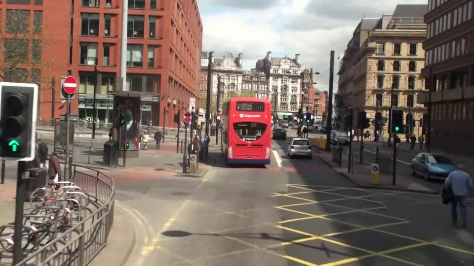
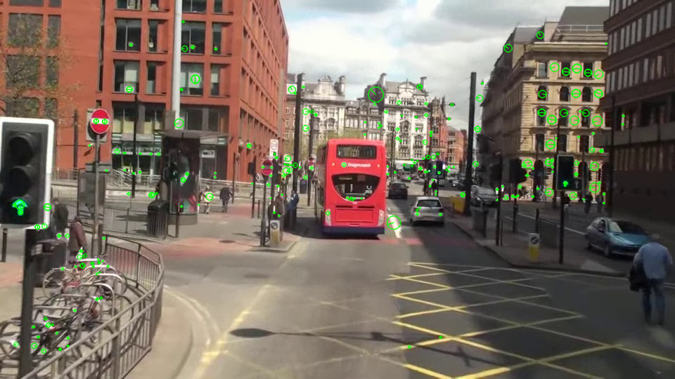
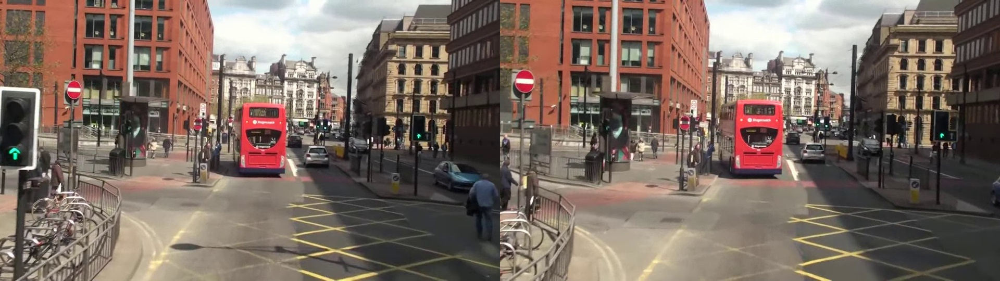
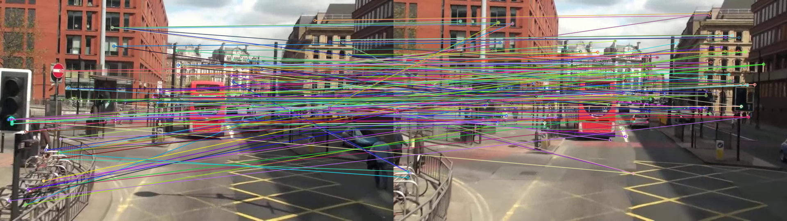
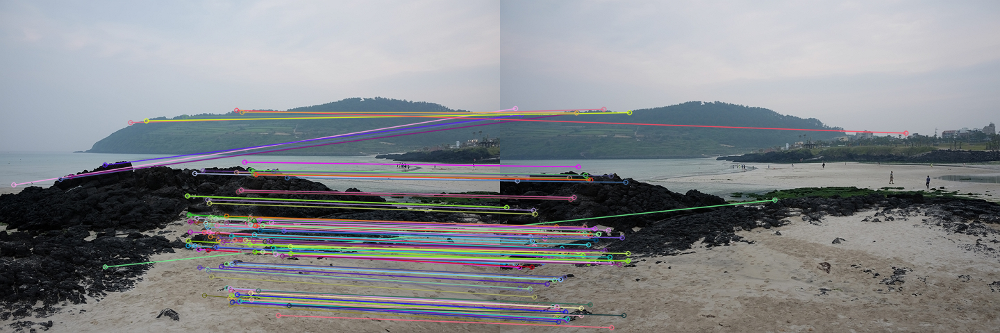
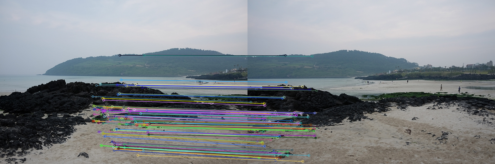

# [PART 1] SIFT 특징점 검출 및 시각화

## 문제 및 요구사항
- 입력 이미지 `mot_color70.jpg`를 로드한다.
- SIFT로 특징점을 검출한다.
- 특징점을 초록색으로 시각화한다.
- 특징점의 크기/방향 정보를 함께 표시한다.
- 원본 이미지와 결과 이미지를 나란히 출력한다.

## 과제 설명
이 파트의 목표는 SIFT 특징점이 실제 이미지에서 어떻게 검출되는지 확인하는 것이다.
SIFT는 스케일과 회전에 강인한 특징점을 제공하므로, 이후 매칭/정합 파이프라인의 기초가 된다.

## 중간 결과물
### 1) 로드된 원본 이미지
- 확인 포인트: 이미지가 깨지지 않고 정상 로드되는지 확인



### 2) 특징점 오버레이 이미지
- 확인 포인트: 특징점이 객체 경계/코너에 집중되어 있는지 확인



## 최종 결과물
### [결과] SIFT Keypoint Visualization
- 검출 keypoint 수: `예) 286`
- descriptor shape: `예) (286, 128)`


## 코드
<details>
    <summary>전체 코드 (라인 단위 설명형)</summary>

```python
# OS 경로 처리를 위해 os 모듈을 임포트한다.
import os
# OpenCV 기능을 사용하기 위해 cv2를 임포트한다.
import cv2 as cv
# 비ASCII 경로 안전 로딩용 바이트 읽기를 위해 numpy를 임포트한다.
import numpy as np
# 시각화를 위해 matplotlib.pyplot을 임포트한다.
import matplotlib.pyplot as plt


# 이미지 파일을 BGR 포맷으로 안전하게 로드하는 함수를 정의한다.
def load_bgr_image(image_path: str):
    # 일반적인 방식으로 먼저 이미지를 읽는다.
    image_bgr = cv.imread(image_path)
    # 일반 로드가 실패하면 비ASCII 경로 대응 로직으로 진입한다.
    if image_bgr is None:
        # 파일을 바이트 배열로 읽어온다.
        raw = np.fromfile(image_path, dtype=np.uint8)
        # 바이트 배열에 데이터가 있으면 디코딩을 시도한다.
        if raw.size > 0:
            # 바이트 배열을 컬러 이미지로 디코딩한다.
            image_bgr = cv.imdecode(raw, cv.IMREAD_COLOR)
    # 최종 로드 결과를 반환한다.
    return image_bgr


# 메인 실행 함수를 정의한다.
def main():
    # 현재 스크립트 파일의 디렉터리 절대경로를 구한다.
    script_dir = os.path.dirname(os.path.abspath(__file__))
    # 입력 이미지 경로를 구성한다.
    image_path = os.path.join(script_dir, "mot_color70.jpg")

    # 입력 이미지를 BGR 형식으로 로드한다.
    original_bgr = load_bgr_image(image_path)
    # 이미지 로드 실패 시 예외를 발생시킨다.
    if original_bgr is None:
        raise FileNotFoundError(f"이미지를 불러올 수 없습니다: {image_path}")

    # SIFT 검출기를 생성한다.
    sift = cv.SIFT_create(
        # 최대 특징점 수를 제한한다.
        nfeatures=300,
        # 대비 임계값을 설정한다.
        contrastThreshold=0.04,
        # 에지 임계값을 설정한다.
        edgeThreshold=10,
        # 가우시안 시그마를 설정한다.
        sigma=1.6,
    )

    # 특징점과 디스크립터를 동시에 계산한다.
    keypoints, descriptors = sift.detectAndCompute(original_bgr, None)

    # 특징점을 원본 위에 그린 결과 이미지를 생성한다.
    keypoint_viz_bgr = cv.drawKeypoints(
        # 원본 이미지를 입력한다.
        original_bgr,
        # 검출된 특징점 목록을 전달한다.
        keypoints,
        # 출력 버퍼는 OpenCV가 새로 할당하도록 None을 준다.
        None,
        # 특징점 색상을 초록색으로 지정한다.
        color=(0, 255, 0),
        # 크기/방향 정보를 포함한 리치 키포인트 모드로 그린다.
        flags=cv.DRAW_MATCHES_FLAGS_DRAW_RICH_KEYPOINTS,
    )

    # matplotlib 표시를 위해 원본 이미지를 RGB로 변환한다.
    original_rgb = cv.cvtColor(original_bgr, cv.COLOR_BGR2RGB)
    # matplotlib 표시를 위해 결과 이미지를 RGB로 변환한다.
    keypoint_viz_rgb = cv.cvtColor(keypoint_viz_bgr, cv.COLOR_BGR2RGB)

    # 결과 시각화용 figure를 생성한다.
    plt.figure(figsize=(14, 6))
    # 1x2 레이아웃의 첫 번째 축을 선택한다.
    plt.subplot(1, 2, 1)
    # 원본 이미지를 출력한다.
    plt.imshow(original_rgb)
    # 첫 번째 축 제목을 설정한다.
    plt.title("Original Image")
    # 축 눈금을 숨긴다.
    plt.axis("off")

    # 1x2 레이아웃의 두 번째 축을 선택한다.
    plt.subplot(1, 2, 2)
    # 특징점 시각화 이미지를 출력한다.
    plt.imshow(keypoint_viz_rgb)
    # 두 번째 축 제목에 keypoint 개수를 표시한다.
    plt.title(f"SIFT Keypoints (count={len(keypoints)})")
    # 축 눈금을 숨긴다.
    plt.axis("off")

    # 레이아웃 간격을 자동 정리한다.
    plt.tight_layout()
    # 화면에 figure를 렌더링한다.
    plt.show()

    # 디스크립터 존재 여부에 따라 콘솔 로그를 출력한다.
    if descriptors is None:
        # keypoint 개수만 출력한다.
        print(f"Detected keypoints: {len(keypoints)}")
        # 디스크립터가 없음을 출력한다.
        print("Descriptors: None")
    else:
        # keypoint 개수를 출력한다.
        print(f"Detected keypoints: {len(keypoints)}")
        # 디스크립터 shape을 출력한다.
        print(f"Descriptors shape: {descriptors.shape}")


if __name__ == "__main__":
    main()
```

</details>

## 핵심 코드 설명
### [핵심 1] SIFT 생성 및 검출
```python
sift = cv.SIFT_create(nfeatures=300, contrastThreshold=0.04, edgeThreshold=10, sigma=1.6)
keypoints, descriptors = sift.detectAndCompute(original_bgr, None)
```
- `nfeatures`: 최대 특징점 수 제한
- `contrastThreshold`: 작을수록 더 많은 특징점 검출
- `edgeThreshold`: 에지성 특징 제거 정도 조절

### [핵심 2] 특징점 시각화
```python
keypoint_viz_bgr = cv.drawKeypoints(
    original_bgr,
    keypoints,
    None,
    color=(0, 255, 0),
    flags=cv.DRAW_MATCHES_FLAGS_DRAW_RICH_KEYPOINTS,
)
```
- 리치 모드로 크기/방향 정보 포함
- 단일 색상 지정으로 시인성 강화

---

# [PART 2] SIFT 기반 두 영상 특징점 매칭

## 문제 및 요구사항
- 입력 이미지 `mot_color70.jpg`, `mot_color80.jpg`를 사용한다.
- SIFT로 두 이미지의 특징점/디스크립터를 추출한다.
- BFMatcher + KNN(2-NN) 매칭을 수행한다.
- Lowe Ratio Test로 좋은 매칭을 선별한다.
- 매칭 결과를 시각화한다.

## 과제 설명
이 파트의 목표는 두 영상 사이 대응점 품질을 높여 안정적인 매칭을 얻는 것이다.
KNN 매칭 후 ratio test를 적용해 오매칭을 줄인다.

## 중간 결과물
### 1) 원본 쌍 이미지


### 2) KNN 전체 후보 매칭 시각화


## 최종 결과물
### [결과] 좋은 매칭 시각화
- KNN 총 매칭 수: `예) 642`
- Ratio Test 통과 수: `예) 182`


## 코드
<details>
    <summary>전체 코드 (라인 단위 설명형)</summary>

```python
# OS 경로 처리를 위해 os 모듈을 임포트한다.
import os
# OpenCV 기능을 사용하기 위해 cv2를 임포트한다.
import cv2 as cv
# 비ASCII 경로 안전 로딩용 바이트 읽기를 위해 numpy를 임포트한다.
import numpy as np
# 시각화를 위해 matplotlib.pyplot을 임포트한다.
import matplotlib.pyplot as plt


# 이미지 파일을 BGR 포맷으로 안전하게 로드하는 함수를 정의한다.
def load_bgr_image(image_path: str):
    # 일반적인 방식으로 먼저 이미지를 읽는다.
    image_bgr = cv.imread(image_path)
    # 일반 로드가 실패하면 비ASCII 경로 대응 로직으로 진입한다.
    if image_bgr is None:
        # 파일을 바이트 배열로 읽어온다.
        raw = np.fromfile(image_path, dtype=np.uint8)
        # 바이트 배열에 데이터가 있으면 디코딩을 시도한다.
        if raw.size > 0:
            # 바이트 배열을 컬러 이미지로 디코딩한다.
            image_bgr = cv.imdecode(raw, cv.IMREAD_COLOR)
    # 최종 로드 결과를 반환한다.
    return image_bgr


# 메인 실행 함수를 정의한다.
def main():
    # 현재 스크립트 파일의 디렉터리 절대경로를 구한다.
    script_dir = os.path.dirname(os.path.abspath(__file__))
    # 첫 번째 입력 이미지 경로를 구성한다.
    image1_path = os.path.join(script_dir, "mot_color70.jpg")
    # 두 번째 입력 이미지 경로를 구성한다.
    image2_path = os.path.join(script_dir, "mot_color80.jpg")

    # 두 이미지를 BGR 형식으로 로드한다.
    image1_bgr = load_bgr_image(image1_path)
    # 두 번째 이미지를 BGR 형식으로 로드한다.
    image2_bgr = load_bgr_image(image2_path)

    # 첫 번째 이미지 로드 실패 시 예외를 발생시킨다.
    if image1_bgr is None:
        # 첫 번째 이미지 실패 메시지를 포함해 예외를 발생시킨다.
        raise FileNotFoundError(f"이미지를 불러올 수 없습니다: {image1_path}")
    # 두 번째 이미지 로드 실패 시 예외를 발생시킨다.
    if image2_bgr is None:
        # 두 번째 이미지 실패 메시지를 포함해 예외를 발생시킨다.
        raise FileNotFoundError(f"이미지를 불러올 수 없습니다: {image2_path}")

    # SIFT 계산 전 첫 번째 이미지를 그레이스케일로 변환한다.
    gray1 = cv.cvtColor(image1_bgr, cv.COLOR_BGR2GRAY)
    # SIFT 계산 전 두 번째 이미지를 그레이스케일로 변환한다.
    gray2 = cv.cvtColor(image2_bgr, cv.COLOR_BGR2GRAY)

    # SIFT 검출기/기술자 객체를 생성한다.
    sift = cv.SIFT_create(
        # 최대 특징점 개수를 설정한다.
        nfeatures=600,
        # 대비 임계값을 설정한다.
        contrastThreshold=0.04,
        # 에지 임계값을 설정한다.
        edgeThreshold=10,
        # 초기 가우시안 시그마를 설정한다.
        sigma=1.6,
    )

    # 첫 번째 이미지에서 특징점과 디스크립터를 계산한다.
    keypoints1, descriptors1 = sift.detectAndCompute(gray1, None)
    # 두 번째 이미지에서 특징점과 디스크립터를 계산한다.
    keypoints2, descriptors2 = sift.detectAndCompute(gray2, None)

    # 첫 번째 또는 두 번째 디스크립터가 없으면 예외를 발생시킨다.
    if descriptors1 is None or descriptors2 is None:
        # 후속 매칭 불가 상황을 명시한 예외를 발생시킨다.
        raise RuntimeError("특징점 디스크립터를 생성하지 못했습니다.")

    # SIFT 디스크립터에 맞는 L2 거리 기반 BFMatcher를 생성한다.
    matcher = cv.BFMatcher(cv.NORM_L2, crossCheck=False)
    # 각 특징점에 대해 최근접 2개 이웃을 찾는 KNN 매칭을 수행한다.
    knn_matches = matcher.knnMatch(descriptors1, descriptors2, k=2)

    # Lowe ratio test 임계값을 설정한다.
    ratio_threshold = 0.75
    # ratio test를 통과한 좋은 매칭을 담을 리스트를 생성한다.
    good_matches = []
    # KNN 매칭 결과를 순회한다.
    for pair in knn_matches:
        # 후보 이웃이 2개 미만이면 ratio test를 수행할 수 없어 건너뛴다.
        if len(pair) < 2:
            # 다음 후보 쌍으로 이동한다.
            continue
        # 최근접/차근접 매칭을 분리한다.
        m, n = pair
        # 최근접 거리가 충분히 작으면 좋은 매칭으로 채택한다.
        if m.distance < ratio_threshold * n.distance:
            # 조건을 통과한 매칭을 리스트에 추가한다.
            good_matches.append(m)

    # 좋은 매칭을 거리 오름차순으로 정렬한다.
    good_matches = sorted(good_matches, key=lambda x: x.distance)
    # 시각화 복잡도를 줄이기 위해 상위 120개만 사용한다.
    matches_to_draw = good_matches[:120]

    # 두 이미지와 매칭선을 하나의 이미지로 렌더링한다.
    match_vis_bgr = cv.drawMatches(
        # 왼쪽 입력 이미지로 첫 번째 이미지를 전달한다.
        image1_bgr,
        # 첫 번째 이미지 특징점을 전달한다.
        keypoints1,
        # 오른쪽 입력 이미지로 두 번째 이미지를 전달한다.
        image2_bgr,
        # 두 번째 이미지 특징점을 전달한다.
        keypoints2,
        # 그릴 매칭 목록을 전달한다.
        matches_to_draw,
        # 출력 버퍼는 OpenCV가 새로 할당하도록 None을 준다.
        None,
        # 단일 특징점은 제외하고 매칭선만 강조한다.
        flags=cv.DrawMatchesFlags_NOT_DRAW_SINGLE_POINTS,
    )

    # matplotlib 표시를 위해 BGR 이미지를 RGB로 변환한다.
    match_vis_rgb = cv.cvtColor(match_vis_bgr, cv.COLOR_BGR2RGB)

    # 결과 시각화를 위한 figure를 생성한다.
    plt.figure(figsize=(16, 7))
    # 매칭 결과 이미지를 출력한다.
    plt.imshow(match_vis_rgb)
    # 제목에 전체/좋은/표시 매칭 수를 함께 표시한다.
    plt.title(
        f"SIFT Matching | total={len(knn_matches)} | good={len(good_matches)} | drawn={len(matches_to_draw)}"
    )
    # 축 눈금을 숨긴다.
    plt.axis("off")
    # 레이아웃 간격을 자동 정리한다.
    plt.tight_layout()
    # 화면에 figure를 렌더링한다.
    plt.show()

    # 첫 번째 이미지 keypoint 개수를 출력한다.
    print(f"Image1 keypoints: {len(keypoints1)}")
    # 두 번째 이미지 keypoint 개수를 출력한다.
    print(f"Image2 keypoints: {len(keypoints2)}")
    # KNN 매칭 수를 출력한다.
    print(f"KNN matches: {len(knn_matches)}")
    # ratio test 통과 매칭 수를 출력한다.
    print(f"Good matches (ratio test): {len(good_matches)}")


if __name__ == "__main__":
    main()
```

</details>

## 핵심 코드 설명
### [핵심 1] KNN 매칭
```python
matcher = cv.BFMatcher(cv.NORM_L2, crossCheck=False)
knn_matches = matcher.knnMatch(descriptors1, descriptors2, k=2)
```

### [핵심 2] Lowe Ratio Test
```python
good_matches = []
ratio_threshold = 0.75
for pair in knn_matches:
    if len(pair) < 2:
        continue
    m, n = pair
    if m.distance < ratio_threshold * n.distance:
        good_matches.append(m)
```

---

# [PART 3] 호모그래피 기반 이미지 정합

## 문제 및 요구사항
- `img1.jpg`, `img2.jpg`에서 SIFT 특징점을 추출한다.
- 대응점 매칭 후 RANSAC 기반 호모그래피를 계산한다.
- `warpPerspective`로 정합 이미지를 생성한다.
- 매칭 결과와 정합 결과를 함께 제시한다.

## 과제 설명
이 파트의 목표는 두 영상 간 평면 변환 관계를 추정해 한 이미지 좌표계를 다른 이미지에 정렬하는 것이다.
RANSAC을 사용해 outlier 영향을 줄이고, inlier 기반으로 정합 품질을 확인한다.

## 중간 결과물
### 1) good matches 시각화


### 2) RANSAC inlier만 필터링한 매칭


## 최종 결과물
### [결과] Homography Alignment
- Good matches: `예) 145`
- Inlier matches: `예) 113`
- Inlier ratio: `예) 77.9%`


## 코드
<details>
    <summary>전체 코드 (라인 단위 설명형)</summary>

```python
# OS 경로 처리를 위해 os 모듈을 임포트한다.
import os
# OpenCV 기능을 사용하기 위해 cv2를 임포트한다.
import cv2 as cv
# 비ASCII 경로 안전 로딩용 바이트 읽기를 위해 numpy를 임포트한다.
import numpy as np
# 시각화를 위해 matplotlib.pyplot을 임포트한다.
import matplotlib.pyplot as plt


# 이미지 파일을 BGR 포맷으로 안전하게 로드하는 함수를 정의한다.
def load_bgr_image(image_path: str):
    # 일반적인 방식으로 먼저 이미지를 읽는다.
    image_bgr = cv.imread(image_path)
    # 일반 로드가 실패하면 비ASCII 경로 대응 로직으로 진입한다.
    if image_bgr is None:
        # 파일을 바이트 배열로 읽어온다.
        raw = np.fromfile(image_path, dtype=np.uint8)
        # 바이트 배열에 데이터가 있으면 디코딩을 시도한다.
        if raw.size > 0:
            # 바이트 배열을 컬러 이미지로 디코딩한다.
            image_bgr = cv.imdecode(raw, cv.IMREAD_COLOR)
    # 최종 로드 결과를 반환한다.
    return image_bgr


# 메인 실행 함수를 정의한다.
def main():
    # 현재 스크립트 파일의 디렉터리 절대경로를 구한다.
    script_dir = os.path.dirname(os.path.abspath(__file__))
    # 기준 이미지 경로를 구성한다.
    image1_path = os.path.join(script_dir, "img1.jpg")
    # 정렬 대상 이미지 경로를 구성한다.
    image2_path = os.path.join(script_dir, "img2.jpg")

    # 기준 이미지를 BGR 형식으로 로드한다.
    image1_bgr = load_bgr_image(image1_path)
    # 정렬 대상 이미지를 BGR 형식으로 로드한다.
    image2_bgr = load_bgr_image(image2_path)

    # 기준 이미지 로드 실패 시 예외를 발생시킨다.
    if image1_bgr is None:
        # 기준 이미지 실패 메시지를 포함해 예외를 발생시킨다.
        raise FileNotFoundError(f"이미지를 불러올 수 없습니다: {image1_path}")
    # 대상 이미지 로드 실패 시 예외를 발생시킨다.
    if image2_bgr is None:
        # 대상 이미지 실패 메시지를 포함해 예외를 발생시킨다.
        raise FileNotFoundError(f"이미지를 불러올 수 없습니다: {image2_path}")

    # SIFT 계산을 위해 기준 이미지를 그레이스케일로 변환한다.
    gray1 = cv.cvtColor(image1_bgr, cv.COLOR_BGR2GRAY)
    # SIFT 계산을 위해 대상 이미지를 그레이스케일로 변환한다.
    gray2 = cv.cvtColor(image2_bgr, cv.COLOR_BGR2GRAY)

    # SIFT 검출기/기술자 객체를 생성한다.
    sift = cv.SIFT_create(
        # 최대 특징점 개수를 설정한다.
        nfeatures=1000,
        # 대비 임계값을 설정한다.
        contrastThreshold=0.04,
        # 에지 임계값을 설정한다.
        edgeThreshold=10,
        # 초기 가우시안 시그마를 설정한다.
        sigma=1.6,
    )

    # 기준 이미지에서 특징점과 디스크립터를 계산한다.
    keypoints1, descriptors1 = sift.detectAndCompute(gray1, None)
    # 대상 이미지에서 특징점과 디스크립터를 계산한다.
    keypoints2, descriptors2 = sift.detectAndCompute(gray2, None)

    # 둘 중 하나라도 디스크립터가 없으면 예외를 발생시킨다.
    if descriptors1 is None or descriptors2 is None:
        # 후속 매칭 불가 상황을 명시한 예외를 발생시킨다.
        raise RuntimeError("특징점 디스크립터를 생성하지 못했습니다.")

    # SIFT 디스크립터에 맞는 L2 거리 기반 BFMatcher를 생성한다.
    matcher = cv.BFMatcher(cv.NORM_L2, crossCheck=False)
    # 최근접 2개 이웃을 구해 ratio test 입력으로 사용한다.
    knn_matches = matcher.knnMatch(descriptors1, descriptors2, k=2)

    # Lowe ratio test 임계값을 설정한다.
    ratio_threshold = 0.7
    # ratio test 통과 매칭을 저장할 리스트를 생성한다.
    good_matches = []
    # KNN 매칭 결과를 순회한다.
    for pair in knn_matches:
        # 후보 이웃이 2개 미만이면 ratio test를 수행할 수 없어 건너뛴다.
        if len(pair) < 2:
            # 다음 후보 쌍으로 이동한다.
            continue
        # 최근접/차근접 매칭을 분리한다.
        m, n = pair
        # 최근접 거리가 충분히 작으면 좋은 매칭으로 채택한다.
        if m.distance < ratio_threshold * n.distance:
            # 조건을 통과한 매칭을 리스트에 추가한다.
            good_matches.append(m)

    # 호모그래피 계산 최소 조건(4쌍) 미만이면 예외를 발생시킨다.
    if len(good_matches) < 4:
        # 매칭 부족 상황을 포함한 예외를 발생시킨다.
        raise RuntimeError(f"호모그래피 계산에 필요한 매칭점이 부족합니다. good_matches={len(good_matches)}")

    # 대상 이미지 좌표(src) 배열을 생성한다.
    src_pts = np.float32([keypoints2[m.trainIdx].pt for m in good_matches]).reshape(-1, 1, 2)
    # 기준 이미지 좌표(dst) 배열을 생성한다.
    dst_pts = np.float32([keypoints1[m.queryIdx].pt for m in good_matches]).reshape(-1, 1, 2)

    # RANSAC 기반 호모그래피를 추정한다.
    homography, inlier_mask = cv.findHomography(src_pts, dst_pts, cv.RANSAC, 5.0)
    # 호모그래피 추정 실패 시 예외를 발생시킨다.
    if homography is None:
        # 추정 실패 상황을 명시한 예외를 발생시킨다.
        raise RuntimeError("호모그래피 행렬 계산에 실패했습니다.")

    # 기준 이미지 높이/너비를 구한다.
    h1, w1 = image1_bgr.shape[:2]
    # 대상 이미지 높이/너비를 구한다.
    h2, w2 = image2_bgr.shape[:2]
    # 파노라마 출력 너비를 계산한다.
    panorama_width = w1 + w2
    # 파노라마 출력 높이를 계산한다.
    panorama_height = max(h1, h2)

    # 대상 이미지를 기준 좌표계로 원근 변환한다.
    warped_bgr = cv.warpPerspective(image2_bgr, homography, (panorama_width, panorama_height))
    # 기준 이미지를 좌상단에 배치해 기준면을 고정한다.
    warped_bgr[0:h1, 0:w1] = image1_bgr

    # inlier 매칭 목록을 담을 리스트를 생성한다.
    inlier_matches = []
    # inlier 마스크가 존재하면 inlier 매칭만 필터링한다.
    if inlier_mask is not None:
        # (N,1) 형태 마스크를 1차원 리스트로 평탄화한다.
        mask_flat = inlier_mask.ravel().tolist()
        # 마스크 값이 1인 매칭만 유지한다.
        inlier_matches = [m for m, keep in zip(good_matches, mask_flat) if keep]
    else:
        # 마스크가 없으면 good matches 전체를 사용한다.
        inlier_matches = good_matches

    # 시각화 복잡도를 줄이기 위해 상위 120개만 사용한다.
    matches_to_draw = inlier_matches[:120]

    # inlier 중심 매칭 시각화 이미지를 생성한다.
    matching_result_bgr = cv.drawMatches(
        # 기준 이미지를 전달한다.
        image1_bgr,
        # 기준 이미지 특징점을 전달한다.
        keypoints1,
        # 대상 이미지를 전달한다.
        image2_bgr,
        # 대상 이미지 특징점을 전달한다.
        keypoints2,
        # 그릴 매칭 목록을 전달한다.
        matches_to_draw,
        # 출력 버퍼는 OpenCV가 새로 할당하도록 None을 준다.
        None,
        # 단일 특징점은 제외하고 매칭선만 강조한다.
        flags=cv.DrawMatchesFlags_NOT_DRAW_SINGLE_POINTS,
    )

    # 원근 변환 결과를 matplotlib 표시용 RGB로 변환한다.
    warped_rgb = cv.cvtColor(warped_bgr, cv.COLOR_BGR2RGB)
    # 매칭 시각화 결과를 matplotlib 표시용 RGB로 변환한다.
    matching_result_rgb = cv.cvtColor(matching_result_bgr, cv.COLOR_BGR2RGB)

    # 결과 비교용 figure를 생성한다.
    plt.figure(figsize=(18, 8))
    # 1x2 레이아웃의 첫 번째 축을 선택한다.
    plt.subplot(1, 2, 1)
    # 원근 변환 결과 이미지를 출력한다.
    plt.imshow(warped_rgb)
    # 첫 번째 축 제목을 설정한다.
    plt.title("Warped Image (Image Alignment)")
    # 축 눈금을 숨긴다.
    plt.axis("off")

    # 1x2 레이아웃의 두 번째 축을 선택한다.
    plt.subplot(1, 2, 2)
    # 매칭 시각화 결과 이미지를 출력한다.
    plt.imshow(matching_result_rgb)
    # 두 번째 축 제목에 매칭 통계를 표시한다.
    plt.title(
        f"Matching Result | KNN={len(knn_matches)} | Good={len(good_matches)} | Inlier={len(inlier_matches)}"
    )
    # 축 눈금을 숨긴다.
    plt.axis("off")

    # 레이아웃 간격을 자동 정리한다.
    plt.tight_layout()
    # 화면에 figure를 렌더링한다.
    plt.show()

    # 기준 이미지 keypoint 개수를 출력한다.
    print(f"Image1 keypoints: {len(keypoints1)}")
    # 대상 이미지 keypoint 개수를 출력한다.
    print(f"Image2 keypoints: {len(keypoints2)}")
    # KNN 매칭 수를 출력한다.
    print(f"KNN matches: {len(knn_matches)}")
    # ratio test 통과 매칭 수를 출력한다.
    print(f"Good matches (ratio<{ratio_threshold}): {len(good_matches)}")
    # RANSAC inlier 매칭 수를 출력한다.
    print(f"Inlier matches (RANSAC): {len(inlier_matches)}")


if __name__ == "__main__":
    main()
```

</details>

## 핵심 코드 설명
### [핵심 1] 호모그래피 추정
```python
homography, inlier_mask = cv.findHomography(src_pts, dst_pts, cv.RANSAC, 5.0)
```
- `cv.RANSAC`: 이상치에 강인한 추정
- `5.0`: reprojection threshold

### [핵심 2] 원근 변환
```python
warped_bgr = cv.warpPerspective(image2_bgr, homography, (panorama_width, panorama_height))
warped_bgr[0:h1, 0:w1] = image1_bgr
```
- `image2`를 `image1` 기준 좌표로 정렬
- 기준면 유지를 위해 `image1`을 좌상단에 배치

---

# 제출 체크리스트
- 과제 설명이 각 PART마다 있는가
- 중간 결과물이 단계별로 있는가
- 최종 결과물에 정량 지표가 있는가
- 전체 코드와 핵심 코드 설명이 모두 있는가
- 실행 환경/실행 방법이 명시되어 있는가

## 실행 환경
- Python 3.11.x
- OpenCV 4.x
- NumPy
- Matplotlib

## 실행 방법
```bash
python 01.sift_feature_detection.py
python 02.sift_feature_matching.py
python 03.homography_image_alignment.py
```
