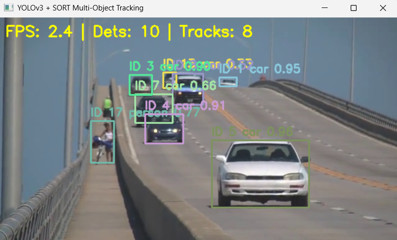
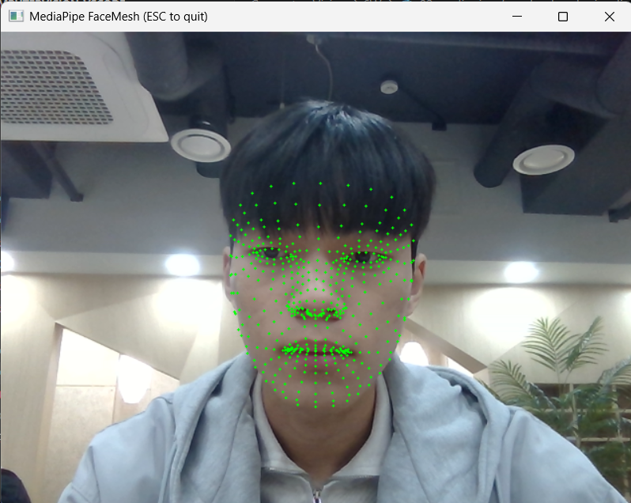

# 1. YOLOv3 + SORT 기반 다중 객체 추적

- YOLOv3 객체 검출기로 각 프레임에서 객체를 탐지
- SORT 알고리즘으로 검출 결과를 프레임 간 추적
- Kalman Filter와 IoU 기반 연관으로 객체 ID를 유지
- 추적된 객체를 ID와 함께 화면에 시각화

<details>
	<summary>전체 코드</summary>

```python
import argparse  # 실행 시 입력 경로와 옵션을 받기 위해 사용합니다.
import importlib  # scipy 설치 여부를 런타임에 확인하기 위해 사용합니다.
import os  # 파일 경로 처리를 위해 사용합니다.
import shutil  # YOLO 모델 파일을 임시 경로로 복사하기 위해 사용합니다.
import tempfile  # 한글 경로 문제를 피하기 위한 임시 캐시를 만들 때 사용합니다.
import time  # FPS 계산을 위해 사용합니다.

import cv2 as cv  # 영상 처리와 DNN 추론을 위해 OpenCV를 사용합니다.
import numpy as np  # 배열 계산과 IoU 계산을 위해 NumPy를 사용합니다.

try:
	scipy_optimize = importlib.import_module("scipy.optimize")  # scipy가 설치되어 있으면 헝가리안 알고리즘을 사용합니다.
	linear_sum_assignment = scipy_optimize.linear_sum_assignment
	SCIPY_AVAILABLE = True
except Exception:
	linear_sum_assignment = None  # scipy가 없으면 greedy assignment로 대체합니다.
	SCIPY_AVAILABLE = False


DEFAULT_COCO_CLASSES = [
    "person", "bicycle", "car", "motorbike", "aeroplane", "bus", "train", "truck", "boat", "traffic light",
    "fire hydrant", "stop sign", "parking meter", "bench", "bird", "cat", "dog", "horse", "sheep", "cow",
    "elephant", "bear", "zebra", "giraffe", "backpack", "umbrella", "handbag", "tie", "suitcase", "frisbee",
    "skis", "snowboard", "sports ball", "kite", "baseball bat", "baseball glove", "skateboard", "surfboard", "tennis racket", "bottle",
    "wine glass", "cup", "fork", "knife", "spoon", "bowl", "banana", "apple", "sandwich", "orange",
    "broccoli", "carrot", "hot dog", "pizza", "donut", "cake", "chair", "sofa", "pottedplant", "bed",
    "diningtable", "toilet", "tvmonitor", "laptop", "mouse", "remote", "keyboard", "cell phone", "microwave", "oven",
    "toaster", "sink", "refrigerator", "book", "clock", "vase", "scissors", "teddy bear", "hair drier", "toothbrush",
]


def load_class_names(names_path: str):
    if os.path.exists(names_path):
        with open(names_path, "r", encoding="utf-8") as f:
            names = [line.strip() for line in f if line.strip()]
        if names:
            return names
    return DEFAULT_COCO_CLASSES


def _make_ascii_cache_path(src_path: str):
    abs_path = os.path.abspath(src_path)
    cache_root = os.path.join(tempfile.gettempdir(), "cv_yolo_cache")
    os.makedirs(cache_root, exist_ok=True)

    file_hash = format(abs(hash(abs_path)), "x")
    _, ext = os.path.splitext(abs_path)
    safe_name = f"model_{file_hash}{ext.lower()}"
    return os.path.join(cache_root, safe_name)


def _ensure_ascii_copy(src_path: str):
    dst_path = _make_ascii_cache_path(src_path)
    need_copy = True

    if os.path.exists(dst_path):
        try:
            need_copy = os.path.getsize(dst_path) != os.path.getsize(src_path)
        except OSError:
            need_copy = True

    if need_copy:
        shutil.copy2(src_path, dst_path)

    return dst_path


def load_darknet_net(cfg_path: str, weights_path: str):
    try:
        return cv.dnn.readNetFromDarknet(cfg_path, weights_path)
    except cv.error as first_error:
        cfg_ascii = _ensure_ascii_copy(cfg_path)
        weights_ascii = _ensure_ascii_copy(weights_path)
        try:
            print("[INFO] OpenCV DNN 경로 이슈 대응: ASCII 임시 경로에서 모델 로드를 재시도합니다.")
            return cv.dnn.readNetFromDarknet(cfg_ascii, weights_ascii)
        except cv.error:
            raise RuntimeError(
                "YOLO 모델 로드에 실패했습니다. cfg/weights 파일 경로 및 파일 손상을 확인하세요.\n"
                f"cfg={cfg_path}\nweights={weights_path}"
            ) from first_error


def get_output_layer_names(net):
    if hasattr(net, "getUnconnectedOutLayersNames"):
        return net.getUnconnectedOutLayersNames()
    layer_names = net.getLayerNames()
    unconnected = net.getUnconnectedOutLayers()
    return [layer_names[i - 1] for i in unconnected.flatten()]


def iou_xyxy(box_a, box_b):
    x1 = max(box_a[0], box_b[0])
    y1 = max(box_a[1], box_b[1])
    x2 = min(box_a[2], box_b[2])
    y2 = min(box_a[3], box_b[3])

    inter_w = max(0.0, x2 - x1)
    inter_h = max(0.0, y2 - y1)
    inter = inter_w * inter_h

    area_a = max(0.0, box_a[2] - box_a[0]) * max(0.0, box_a[3] - box_a[1])
    area_b = max(0.0, box_b[2] - box_b[0]) * max(0.0, box_b[3] - box_b[1])
    union = area_a + area_b - inter

    return inter / union if union > 1e-6 else 0.0


def detect_objects_yolo(net, frame, conf_threshold=0.5, nms_threshold=0.4, input_size=416):
    h, w = frame.shape[:2]

    blob = cv.dnn.blobFromImage(
        frame,
        scalefactor=1.0 / 255.0,
        size=(input_size, input_size),
        swapRB=True,
        crop=False,
    )
    net.setInput(blob)
    outputs = net.forward(get_output_layer_names(net))

    boxes_xywh = []
    confidences = []
    class_ids = []

    for output in outputs:
        for det in output:
            scores = det[5:]
            class_id = int(np.argmax(scores))
            confidence = float(scores[class_id])

            if confidence < conf_threshold:
                continue

            cx = int(det[0] * w)
            cy = int(det[1] * h)
            bw = int(det[2] * w)
            bh = int(det[3] * h)

            x = int(cx - bw / 2)
            y = int(cy - bh / 2)

            boxes_xywh.append([x, y, bw, bh])
            confidences.append(confidence)
            class_ids.append(class_id)

    indices = cv.dnn.NMSBoxes(boxes_xywh, confidences, conf_threshold, nms_threshold)

    detections_xyxy = []
    kept_class_ids = []
    kept_confidences = []

    if len(indices) > 0:
        for idx in indices.flatten():
            x, y, bw, bh = boxes_xywh[idx]
            x1 = max(0, x)
            y1 = max(0, y)
            x2 = min(w - 1, x + bw)
            y2 = min(h - 1, y + bh)
            if x2 <= x1 or y2 <= y1:
                continue
            detections_xyxy.append([float(x1), float(y1), float(x2), float(y2)])
            kept_class_ids.append(class_ids[idx])
            kept_confidences.append(confidences[idx])

    if detections_xyxy:
        det_array = np.array(detections_xyxy, dtype=np.float32)
    else:
        det_array = np.empty((0, 4), dtype=np.float32)

    return det_array, kept_class_ids, kept_confidences


def convert_bbox_to_z(bbox):
    x1, y1, x2, y2 = bbox
    w = x2 - x1
    h = y2 - y1
    cx = x1 + w / 2.0
    cy = y1 + h / 2.0
    s = w * h
    r = w / h if h > 1e-6 else 0.0
    return np.array([[cx], [cy], [s], [r]], dtype=np.float32)


def convert_x_to_bbox(x):
    cx, cy, s, r = x[0], x[1], x[2], x[3]
    if s <= 0 or r <= 0:
        return np.array([0.0, 0.0, 0.0, 0.0], dtype=np.float32)
    w = np.sqrt(s * r)
    h = s / w if w > 1e-6 else 0.0
    x1 = cx - w / 2.0
    y1 = cy - h / 2.0
    x2 = cx + w / 2.0
    y2 = cy + h / 2.0
    return np.array([x1, y1, x2, y2], dtype=np.float32)


class KalmanBoxTracker:
    count = 0

    def __init__(self, bbox):
        self.kf = cv.KalmanFilter(7, 4)

        self.kf.transitionMatrix = np.array(
            [
                [1, 0, 0, 0, 1, 0, 0],
                [0, 1, 0, 0, 0, 1, 0],
                [0, 0, 1, 0, 0, 0, 1],
                [0, 0, 0, 1, 0, 0, 0],
                [0, 0, 0, 0, 1, 0, 0],
                [0, 0, 0, 0, 0, 1, 0],
                [0, 0, 0, 0, 0, 0, 1],
            ],
            dtype=np.float32,
        )
        self.kf.measurementMatrix = np.array(
            [
                [1, 0, 0, 0, 0, 0, 0],
                [0, 1, 0, 0, 0, 0, 0],
                [0, 0, 1, 0, 0, 0, 0],
                [0, 0, 0, 1, 0, 0, 0],
            ],
            dtype=np.float32,
        )
        self.kf.processNoiseCov = np.eye(7, dtype=np.float32) * 1e-2
        self.kf.measurementNoiseCov = np.eye(4, dtype=np.float32) * 1e-1
        self.kf.errorCovPost = np.eye(7, dtype=np.float32)

        z = convert_bbox_to_z(bbox)
        self.kf.statePost = np.array(
            [[z[0, 0]], [z[1, 0]], [z[2, 0]], [z[3, 0]], [0], [0], [0]],
            dtype=np.float32,
        )

        self.time_since_update = 0
        self.id = KalmanBoxTracker.count
        KalmanBoxTracker.count += 1
        self.history = []
        self.hits = 0
        self.hit_streak = 0
        self.age = 0

    def update(self, bbox):
        self.time_since_update = 0
        self.history.clear()
        self.hits += 1
        self.hit_streak += 1
        z = convert_bbox_to_z(bbox)
        self.kf.correct(z)

    def predict(self):
        if (self.kf.statePost[6, 0] + self.kf.statePost[2, 0]) <= 0:
            self.kf.statePost[6, 0] = 0

        prediction = self.kf.predict()
        self.age += 1

        if self.time_since_update > 0:
            self.hit_streak = 0

        self.time_since_update += 1
        pred_bbox = convert_x_to_bbox(prediction[:, 0])
        self.history.append(pred_bbox)
        return pred_bbox

    def get_state(self):
        return convert_x_to_bbox(self.kf.statePost[:, 0])


def greedy_assignment(iou_matrix):
    matches = []
    if iou_matrix.size == 0:
        return np.empty((0, 2), dtype=int)

    used_rows = set()
    used_cols = set()

    flat_indices = np.argsort(-iou_matrix, axis=None)
    rows, cols = np.unravel_index(flat_indices, iou_matrix.shape)

    for r, c in zip(rows, cols):
        if r in used_rows or c in used_cols:
            continue
        used_rows.add(r)
        used_cols.add(c)
        matches.append([r, c])

    if not matches:
        return np.empty((0, 2), dtype=int)
    return np.array(matches, dtype=int)


def associate_detections_to_trackers(detections, trackers, iou_threshold=0.3):
    if len(trackers) == 0:
        return (
            np.empty((0, 2), dtype=int),
            np.arange(len(detections)),
            np.empty((0,), dtype=int),
        )

    iou_matrix = np.zeros((len(detections), len(trackers)), dtype=np.float32)
    for d, det in enumerate(detections):
        for t, trk in enumerate(trackers):
            iou_matrix[d, t] = iou_xyxy(det, trk)

    if SCIPY_AVAILABLE:
        row_ind, col_ind = linear_sum_assignment(-iou_matrix)
        matched_indices = np.stack([row_ind, col_ind], axis=1) if len(row_ind) > 0 else np.empty((0, 2), dtype=int)
    else:
        matched_indices = greedy_assignment(iou_matrix)

    unmatched_detections = []
    for d in range(len(detections)):
        if d not in matched_indices[:, 0] if len(matched_indices) > 0 else True:
            unmatched_detections.append(d)

    unmatched_trackers = []
    for t in range(len(trackers)):
        if t not in matched_indices[:, 1] if len(matched_indices) > 0 else True:
            unmatched_trackers.append(t)

    matches = []
    for m in matched_indices:
        if iou_matrix[m[0], m[1]] < iou_threshold:
            unmatched_detections.append(m[0])
            unmatched_trackers.append(m[1])
        else:
            matches.append(m)

    if len(matches) == 0:
        matches = np.empty((0, 2), dtype=int)
    else:
        matches = np.array(matches, dtype=int)

    return matches, np.array(unmatched_detections), np.array(unmatched_trackers)


class SortTracker:
    def __init__(self, max_age=15, min_hits=3, iou_threshold=0.3):
        self.max_age = max_age
        self.min_hits = min_hits
        self.iou_threshold = iou_threshold
        self.trackers = []
        self.frame_count = 0

    def update(self, detections):
        self.frame_count += 1

        trks = np.zeros((len(self.trackers), 4), dtype=np.float32)
        to_del = []

        for t, trk in enumerate(self.trackers):
            pos = trk.predict()
            trks[t] = pos
            if np.any(np.isnan(pos)):
                to_del.append(t)

        for t in reversed(to_del):
            self.trackers.pop(t)

        trks = np.array([trk.get_state() for trk in self.trackers], dtype=np.float32) if self.trackers else np.empty((0, 4), dtype=np.float32)

        matched, unmatched_dets, unmatched_trks = associate_detections_to_trackers(
            detections,
            trks,
            self.iou_threshold,
        )

        for m in matched:
            self.trackers[m[1]].update(detections[m[0]])

        for i in unmatched_dets:
            self.trackers.append(KalmanBoxTracker(detections[i]))

        results = []
        for trk in reversed(self.trackers):
            d = trk.get_state()
            if trk.time_since_update < 1 and (trk.hit_streak >= self.min_hits or self.frame_count <= self.min_hits):
                results.append(np.concatenate([d, [trk.id + 1]], axis=0))
            if trk.time_since_update > self.max_age:
                self.trackers.remove(trk)

        if len(results) > 0:
            return np.stack(results, axis=0)
        return np.empty((0, 5), dtype=np.float32)


def get_track_color(track_id):
    rng = np.random.default_rng(track_id * 9973)
    color = rng.integers(80, 255, size=3)
    return int(color[0]), int(color[1]), int(color[2])


def assign_class_to_tracks(tracks, detections, class_ids, confidences):
    track_info = {}
    if len(tracks) == 0 or len(detections) == 0:
        return track_info

    for trk in tracks:
        tx1, ty1, tx2, ty2, tid = trk
        best_iou = 0.0
        best_idx = -1
        for i, det in enumerate(detections):
            score = iou_xyxy([tx1, ty1, tx2, ty2], det)
            if score > best_iou:
                best_iou = score
                best_idx = i

        if best_idx >= 0 and best_iou > 0.1:
            track_info[int(tid)] = {
                "class_id": int(class_ids[best_idx]),
                "confidence": float(confidences[best_idx]),
            }

    return track_info


def parse_args():
    script_dir = os.path.dirname(os.path.abspath(__file__))

    parser = argparse.ArgumentParser(description="YOLOv3 + SORT multi-object tracking")
    parser.add_argument("--video", type=str, default=os.path.join(script_dir, "slow_traffic_small.mp4"), help="Input video path")
    parser.add_argument("--cfg", type=str, default=os.path.join(script_dir, "yolov3.cfg"), help="YOLOv3 config path")
    parser.add_argument("--weights", type=str, default=os.path.join(script_dir, "yolov3.weights"), help="YOLOv3 weights path")
    parser.add_argument("--names", type=str, default=os.path.join(script_dir, "coco.names"), help="Class names path")
    parser.add_argument("--conf-thres", type=float, default=0.5, help="Detection confidence threshold")
    parser.add_argument("--nms-thres", type=float, default=0.4, help="NMS IoU threshold")
    parser.add_argument("--iou-thres", type=float, default=0.3, help="SORT association IoU threshold")
    parser.add_argument("--max-age", type=int, default=15, help="Max missing frames before track deletion")
    parser.add_argument("--min-hits", type=int, default=3, help="Min hits to confirm a track")
    parser.add_argument("--input-size", type=int, default=416, help="YOLO input size")
    parser.add_argument("--save", type=str, default="", help="Optional output video path")
    parser.add_argument("--use-cuda", action="store_true", help="Use CUDA backend if available")
    return parser.parse_args()


def main():
    args = parse_args()

    if not os.path.exists(args.video):
        raise FileNotFoundError(f"비디오 파일을 찾을 수 없습니다: {args.video}")
    if not os.path.exists(args.cfg):
        raise FileNotFoundError(f"YOLO cfg 파일을 찾을 수 없습니다: {args.cfg}")
    if not os.path.exists(args.weights):
        raise FileNotFoundError(f"YOLO weights 파일을 찾을 수 없습니다: {args.weights}")

    class_names = load_class_names(args.names)

    net = load_darknet_net(args.cfg, args.weights)
    if args.use_cuda:
        net.setPreferableBackend(cv.dnn.DNN_BACKEND_CUDA)
        net.setPreferableTarget(cv.dnn.DNN_TARGET_CUDA)
    else:
        net.setPreferableBackend(cv.dnn.DNN_BACKEND_OPENCV)
        net.setPreferableTarget(cv.dnn.DNN_TARGET_CPU)

    cap = cv.VideoCapture(args.video)
    if not cap.isOpened():
        raise RuntimeError(f"비디오를 열 수 없습니다: {args.video}")

    writer = None
    if args.save:
        fourcc = cv.VideoWriter_fourcc(*"mp4v")
        fps_out = cap.get(cv.CAP_PROP_FPS)
        if fps_out <= 0:
            fps_out = 25.0
        width = int(cap.get(cv.CAP_PROP_FRAME_WIDTH))
        height = int(cap.get(cv.CAP_PROP_FRAME_HEIGHT))
        writer = cv.VideoWriter(args.save, fourcc, fps_out, (width, height))

    tracker = SortTracker(max_age=args.max_age, min_hits=args.min_hits, iou_threshold=args.iou_thres)

    prev_time = time.perf_counter()
    smooth_fps = 0.0

    print("실행 중: 종료하려면 q 또는 ESC를 누르세요.")

    while True:
        ret, frame = cap.read()
        if not ret:
            break

        detections, class_ids, confidences = detect_objects_yolo(
            net,
            frame,
            conf_threshold=args.conf_thres,
            nms_threshold=args.nms_thres,
            input_size=args.input_size,
        )

        tracks = tracker.update(detections)
        track_extra = assign_class_to_tracks(tracks, detections, class_ids, confidences)

        for trk in tracks:
            x1, y1, x2, y2, tid = trk.astype(int)
            color = get_track_color(tid)

            label = f"ID {tid}"
            if tid in track_extra:
                cid = track_extra[tid]["class_id"]
                conf = track_extra[tid]["confidence"]
                cname = class_names[cid] if 0 <= cid < len(class_names) else str(cid)
                label = f"ID {tid} {cname} {conf:.2f}"

            cv.rectangle(frame, (x1, y1), (x2, y2), color, 2)
            cv.putText(frame, label, (x1, max(20, y1 - 8)), cv.FONT_HERSHEY_SIMPLEX, 0.6, color, 2)

        now = time.perf_counter()
        inst_fps = 1.0 / max(now - prev_time, 1e-6)
        prev_time = now
        smooth_fps = inst_fps if smooth_fps == 0.0 else (0.9 * smooth_fps + 0.1 * inst_fps)

        info_text = f"FPS: {smooth_fps:.1f} | Dets: {len(detections)} | Tracks: {len(tracks)}"
        cv.putText(frame, info_text, (10, 30), cv.FONT_HERSHEY_SIMPLEX, 0.8, (0, 255, 255), 2)

        if writer is not None:
            writer.write(frame)

        cv.imshow("YOLOv3 + SORT Multi-Object Tracking", frame)
        key = cv.waitKey(1) & 0xFF
        if key in (27, ord("q")):
            break

    cap.release()
    if writer is not None:
        writer.release()
    cv.destroyAllWindows()


if __name__ == "__main__":
    main()

</details>

## 1) YOLOv3 검출 + SORT 추적

YOLOv3로 매 프레임의 객체를 검출하고, SORT가 그 결과를 프레임 간에 연결해 동일 객체에 같은 ID를 부여합니다.

```python
net = load_darknet_net(args.cfg, args.weights)  # 한글 경로 문제를 포함해 YOLO 모델을 안전하게 로드합니다.
detections, class_ids, confidences = detect_objects_yolo(
	net,
	frame,
	conf_threshold=args.conf_thres,
	nms_threshold=args.nms_thres,
	input_size=args.input_size,
)

tracks = tracker.update(detections)  # 검출 결과를 SORT 추적기에 넣어 추적 상태를 갱신합니다.
```

## 2) Kalman Filter + IoU 연관

SORT는 칼만 필터로 다음 위치를 예측하고, IoU가 가장 큰 검출 박스를 헝가리안 알고리즘으로 매칭합니다.

```python
if SCIPY_AVAILABLE:
	row_ind, col_ind = linear_sum_assignment(-iou_matrix)  # IoU를 최대화하는 매칭을 찾습니다.
else:
	matched_indices = greedy_assignment(iou_matrix)  # scipy가 없으면 greedy 방식으로 대체합니다.
```

## 3) 결과 시각화

추적된 객체는 ID와 클래스 이름을 함께 표시해 실시간으로 확인할 수 있습니다.

```python
cv.rectangle(frame, (x1, y1), (x2, y2), color, 2)  # 객체 경계 상자를 그립니다.
cv.putText(frame, label, (x1, max(20, y1 - 8)), cv.FONT_HERSHEY_SIMPLEX, 0.6, color, 2)  # ID와 클래스명을 표시합니다.
```

### 실행 방법

```bash
python 01.yolo_sort_multi_object_tracking.py
```

### 참고

- 입력 비디오는 `slow_traffic_small.mp4`를 사용합니다.
- `scipy`가 있으면 헝가리안 알고리즘을 사용하고, 없으면 greedy assignment로 자동 전환됩니다.
- `coco.names`가 없어도 기본 COCO 클래스 목록으로 동작합니다.

### 실행 화면




# 2. MediaPipe FaceMesh 기반 얼굴 랜드마크 시각화

- MediaPipe FaceMesh로 얼굴의 468개 랜드마크를 검출
- OpenCV 웹캠 영상을 실시간으로 캡처
- 검출된 랜드마크를 점으로 표시
- ESC 키를 누르면 종료

<details>
	<summary>전체 코드</summary>

```python
import cv2 as cv  # 웹캠 캡처와 랜드마크 시각화를 위해 OpenCV를 사용합니다.

try:
	import mediapipe as mp  # FaceMesh를 사용하기 위한 MediaPipe를 불러옵니다.
except ImportError as exc:
	raise ImportError("mediapipe is not installed. Install with: pip install mediapipe") from exc


def draw_face_landmarks(frame_bgr, face_landmarks):
	h, w = frame_bgr.shape[:2]  # 프레임 크기를 가져옵니다.
	for lm in face_landmarks.landmark:  # 얼굴의 모든 랜드마크를 순회합니다.
		x = int(lm.x * w)  # 정규화된 x 좌표를 픽셀 좌표로 변환합니다.
		y = int(lm.y * h)  # 정규화된 y 좌표를 픽셀 좌표로 변환합니다.
		if 0 <= x < w and 0 <= y < h:
			cv.circle(frame_bgr, (x, y), 1, (0, 255, 0), -1)  # 랜드마크를 초록 점으로 표시합니다.


def main():
	mp_face_mesh = mp.solutions.face_mesh  # FaceMesh 모듈을 준비합니다.

	cap = cv.VideoCapture(0)  # 웹캠을 엽니다.
	if not cap.isOpened():
		raise RuntimeError("Could not open webcam (index 0).")

	with mp_face_mesh.FaceMesh(
		static_image_mode=False,
		max_num_faces=1,
		refine_landmarks=False,
		min_detection_confidence=0.5,
		min_tracking_confidence=0.5,
	) as face_mesh:
		while True:
			ret, frame_bgr = cap.read()  # 웹캠에서 프레임을 읽습니다.
			if not ret:
				break

			frame_bgr = cv.flip(frame_bgr, 1)  # 거울처럼 보이도록 좌우 반전합니다.
			frame_rgb = cv.cvtColor(frame_bgr, cv.COLOR_BGR2RGB)  # MediaPipe 입력 형식에 맞게 RGB로 변환합니다.
			results = face_mesh.process(frame_rgb)  # 얼굴 랜드마크를 검출합니다.

			if results.multi_face_landmarks:
				for face_landmarks in results.multi_face_landmarks:
					draw_face_landmarks(frame_bgr, face_landmarks)  # 검출된 랜드마크를 화면에 표시합니다.

			cv.imshow("MediaPipe FaceMesh (ESC to quit)", frame_bgr)  # 결과 영상을 출력합니다.

			key = cv.waitKey(1) & 0xFF  # 키 입력을 확인합니다.
			if key == 27:
				break  # ESC 키를 누르면 종료합니다.

	cap.release()  # 웹캠을 해제합니다.
	cv.destroyAllWindows()  # 모든 창을 닫습니다.


if __name__ == "__main__":
	main()
```

</details>

## 1) FaceMesh 초기화와 웹캠 캡처

MediaPipe의 FaceMesh를 사용해 얼굴 랜드마크 검출기를 만들고, OpenCV로 웹캠 영상을 받아옵니다.

```python
mp_face_mesh = mp.solutions.face_mesh  # FaceMesh 모듈을 준비합니다.
cap = cv.VideoCapture(0)  # 웹캠을 엽니다.
```

## 2) 랜드마크 좌표를 픽셀로 변환

랜드마크는 0~1 범위의 정규화 좌표이므로, 프레임의 너비와 높이를 곱해 실제 픽셀 좌표로 바꿔야 합니다.

```python
x = int(lm.x * w)  # x 좌표를 픽셀 좌표로 변환합니다.
y = int(lm.y * h)  # y 좌표를 픽셀 좌표로 변환합니다.
cv.circle(frame_bgr, (x, y), 1, (0, 255, 0), -1)  # 각 랜드마크를 점으로 그립니다.
```

## 3) ESC 종료 처리

실시간 카메라 확인 중 ESC 키를 누르면 프로그램이 종료되도록 구성했습니다.

```python
key = cv.waitKey(1) & 0xFF  # 키 입력을 확인합니다.
if key == 27:
	break  # ESC 키를 누르면 종료합니다.
```

### 실행 방법

```bash
python 02.mediapipe_face_landmark_visualization.py
```

### 참고

- `mediapipe`, `opencv-python`이 필요합니다.
- 현재 환경에서는 `protobuf` 호환성 문제를 우회하기 위해 MediaPipe와 함께 동작하는 버전으로 맞춰두었습니다.

### 실행 화면


```
